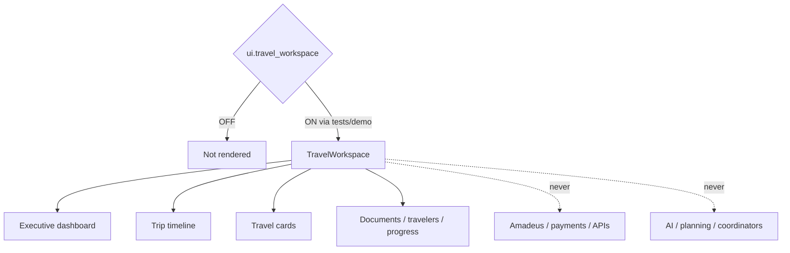

# Premium Travel Workspace — Phase 4 Stage 5

**Status:** Additive UI architecture · Flag `ui.travel_workspace` **default OFF**  
**Depends on:** `ui.application_shell`  
**Freeze:** Production routes · AI · planning · Runtime Coordinator · Conversation Orchestrator · Search/Decision engines · Travel Intelligence · Experience Layer · Conversation/Voice/Knowledge centers · booking / Amadeus / payments / APIs · prior PRs.

Operational journey screen after planning — **presentation models only**.

---

## 1. Why production remains unchanged

1. Flag default **OFF**  
2. Package **not mounted** in `main.tsx`  
3. `TravelWorkspace` returns `null` when the flag is OFF  
4. Quick actions are **buttons only** (no Chat/Voice/Knowledge/Maps embedding)  
5. No booking providers, Amadeus, payments, backend, or AI execution  

---

## 2. Modules

`src/ui/travelWorkspace/` includes dashboard, tripTimeline, flight/hotel/transport/meeting/activity cards, dailyAgenda, tripOverview, travelerList, documentsPanel, ticket/qr cards, tripStatus/progress, budgetSummary, weather/currency/visa placeholders, alertsPanel, quickActions, mapPreview, tripStatistics, tripNotes, attachments, checklists, sharedItems, registry, types, index.

---

## 3. Design

Premium executive aesthetic · light/dark · RTL · responsive · motion with reduced-motion respect · localization-ready copy keys via locale props.

---

## 4. Feature flag

| Id | Default | Depends on |
|----|---------|------------|
| `ui.travel_workspace` | OFF | `ui.application_shell` |

Force-render: `<TravelWorkspace enabled />` or `tryRenderTravelWorkspace({ enabled: true })`.
