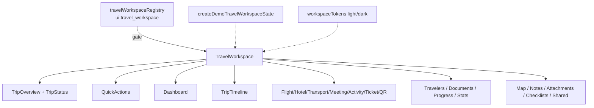

# Travel Workspace — Architecture Documentation

**Phase 4 Stage 5** · Package `src/ui/travelWorkspace`

## Isolation matrix

| Surface | Wired? |
|---------|--------|
| Production routes | No |
| Runtime Coordinator | No |
| Conversation Orchestrator | No |
| Conversation / Voice / Knowledge Centers | No (quick-action buttons only) |
| Planning / AI / Search / Decision / Intelligence / Experience | No |
| Amadeus / booking / payments / APIs | No |

## Quick actions

Buttons emit optional callbacks: Open Chat · Open Voice · Open Knowledge · View Documents · Open Maps · Contact Support · Share Trip · Export PDF — **no runtime embedding**.
