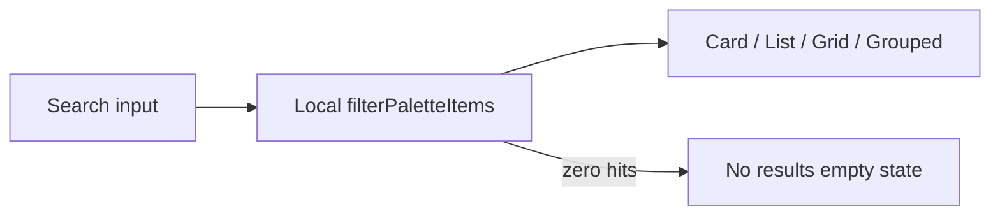

# Universal Search — Phase 4 Stage 8

**Flag:** `ui.command_palette` (default OFF)  
**Package:** `src/ui/commandPalette/`

Presentation-only global search chrome covering:

Trips · Travelers · Flights · Hotels · Documents · Notifications · History · Bookmarks · Favorites · Destinations

Local string filtering only — **no** backend, realtime search, AI search, indexing, or API calls.

