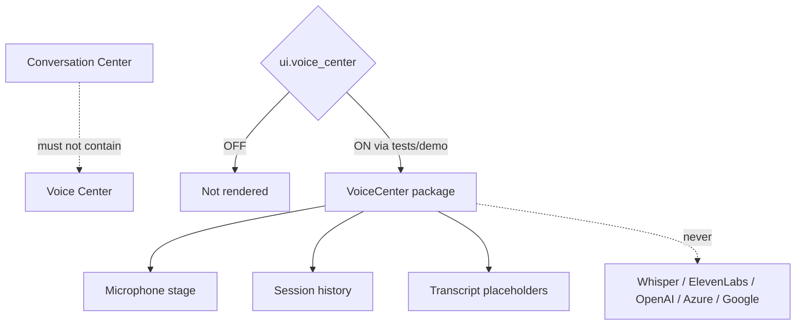

# Premium Voice Conversation Center — Phase 4 Stage 3

**Status:** Additive UI architecture · Flag `ui.voice_center` **default OFF**  
**Depends on:** `ui.application_shell`  
**Freeze:** Production routes · Chat Conversation Center embeds · Runtime Coordinator · Conversation Orchestrator · TTS · STT · AI / APIs · Whisper / ElevenLabs / OpenAI Voice / Azure / Google Speech · prior PRs.

Voice is a **dedicated destination**. It is **not** inside Chat.

---

## 1. Why production remains unchanged

1. Flag default **OFF** (depends on shell, also OFF)  
2. Package **not mounted** in `main.tsx`  
3. `VoiceCenter` returns `null` when the flag is OFF  
4. No TTS/STT/AI/networking wiring  
5. No edits to prior Phase 4 Stage 1–2 packages beyond additive flag registration  

---

## 2. Screen architecture

| Region | Role |
|--------|------|
| Session history | Recent / Favorites / Archived + search + rename/archive/delete/favorite |
| Brand + mic stage | Full-screen immersive mic, wave, status |
| Controls | Start / Pause / Resume / Stop / Mute / Speaker / Headphones / Settings / Replay / Clear |
| Shortcuts | Plan trip, visa, destination, executive, budget, nearby |
| Transcript | Traveler + assistant live areas, timeline, confidence, expand/copy/export placeholder |
| Personality / settings | Voice/language/accent/speed/style + DSP placeholders |

---

## 3. Voice states

Idle · Listening · Processing · Speaking · Paused · Disconnected · Offline · Permission Required · Noise Detected · Muted

Transitions are **UI-only** via `applyVoiceControl` — no speech engine.

---

## 4. Package map

`src/ui/voiceCenter/`

- `VoiceCenter.tsx` — root gate + layout  
- `MicrophoneStage.tsx` — mic + animations  
- `VoiceControls.tsx` · `VoiceShortcuts.tsx`  
- `TranscriptPanel.tsx` · `SessionHistory.tsx`  
- `VoicePersonalityPanel.tsx` · `VoiceSettingsPanel.tsx`  
- `state/` · `design/` · `types.ts` · registry  

---

## 5. Feature flag

| Id | Default | Depends on |
|----|---------|------------|
| `ui.voice_center` | OFF | `ui.application_shell` |

Force-render: `<VoiceCenter enabled />` or `tryRenderVoiceCenter({ enabled: true })`.
