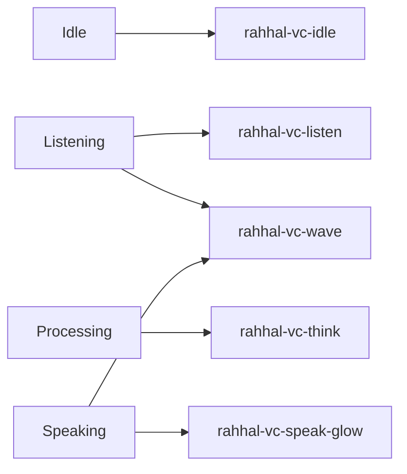

# Voice Center — Animation Guide

**Phase 4 Stage 3** · CSS motion tokens in `VOICE_TOKENS` / `voiceCenter.css`

## Intentional motions

| Animation | Trigger state | Token | Behavior |
|-----------|---------------|-------|----------|
| Idle breath | `idle` | `--rahhal-vc-anim-idle` (2400ms) | Soft mic scale pulse |
| Listening ring | `listening` | `--rahhal-vc-anim-listen` (1100ms) | Expanding ring fade-out |
| Thinking orbit | `processing` | `--rahhal-vc-anim-think` (1600ms) | Dashed ring rotation |
| Speaking glow | `speaking` | `--rahhal-vc-anim-speak` (900ms) | Cyan glow pulse on mic |
| Wave bars | `listening` / `speaking` | same speak duration | Staggered bar height wave |

## Mapping

## Principles

- Motion signals **state presence**, not noise — one primary animation per state.  
- Wave visualization is a **placeholder** (CSS bars), not audio analysis.  
- Transitions use `--rahhal-vc-transition` (200ms ease) for control chrome.  
- No Web Audio API, MediaRecorder, or vendor SDKs.
