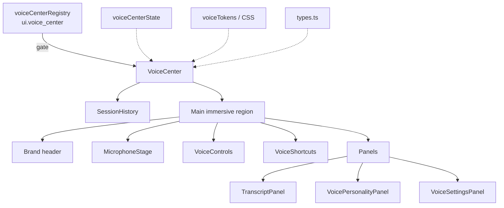

# Voice Center — Component Diagram

**Phase 4 Stage 3** · Package `src/ui/voiceCenter`

## Responsibilities

| Component | Responsibility |
|-----------|----------------|
| `VoiceCenter` | Feature gate, full-screen composition, local UI state |
| `MicrophoneStage` | Large mic, wave, idle/listen/think/speak animations, status |
| `VoiceControls` | Start/pause/resume/stop/mute/speaker/headphones/settings/replay/clear |
| `TranscriptPanel` | Traveler/assistant areas, timeline, confidence, expand/copy/export placeholder |
| `SessionHistory` | Recent/favorites/archived voice sessions (not Chat history) |
| `VoicePersonalityPanel` | Voice/language/accent/speed/style placeholders |
| `VoiceSettingsPanel` | Noise/echo/punctuation/language-detect placeholders |
| `VoiceShortcuts` | Intent chips updating local traveler text only |
