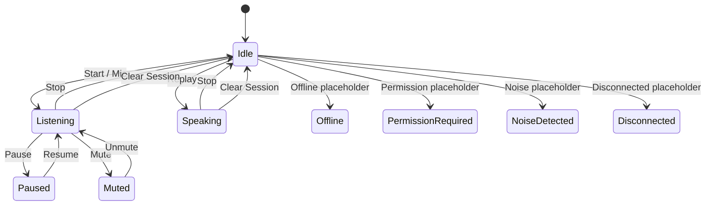
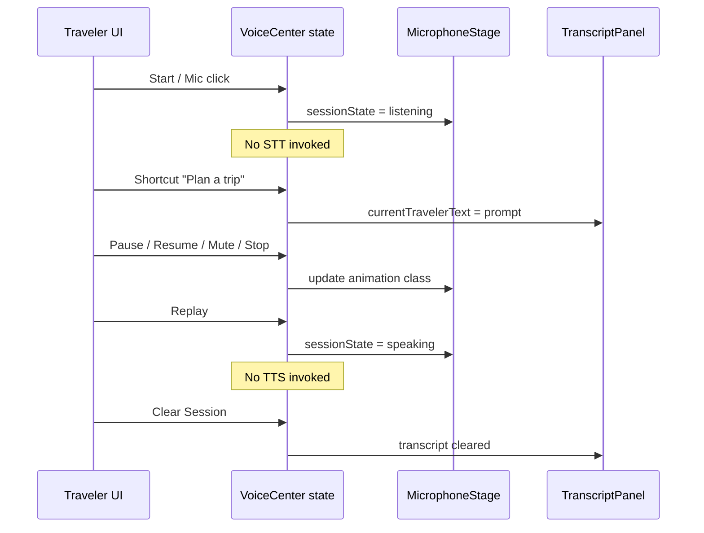

# Voice Center — Interaction Diagram

**Phase 4 Stage 3** · UI-only interactions · No speech / AI / APIs

## Interaction rules

1. Controls only mutate local `VoiceCenterUiState`.  
2. Shortcuts never call AI — they set placeholder traveler text.  
3. Export / voice selector / DSP toggles are placeholders (`data-placeholder`).  
4. Session history actions (rename/archive/delete/favorite) are local list mutations.  
5. Chat Conversation Center is never opened or embedded from these controls.
