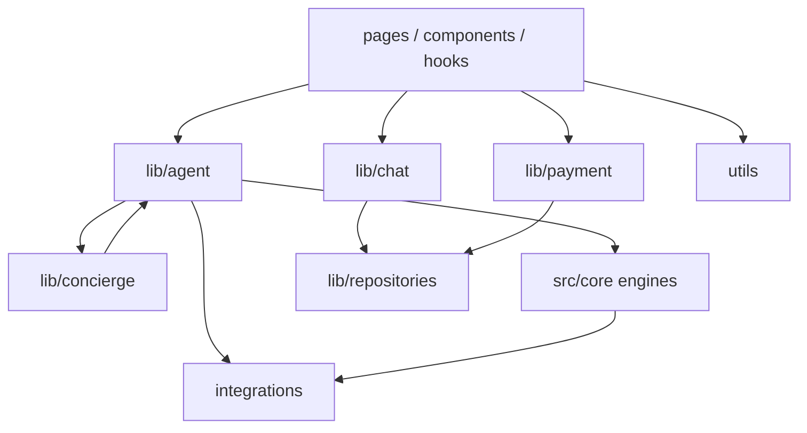

# Dependency Graph

## Enforcement

```bash
npm run arch:circular   # zero-dep cycle detector — must report 0 cycles
```

Status: **0 circular dependencies** under `src/`.

## Target dependency direction



## Forbidden edges

- `core` → `pages` / `components`
- `integrations` → UI
- Adapter/mock modules → fat `utils/contracts` barrel (use leaf contract paths)
- Orchestrator types → `brain/integration.ts` (use `integrationTypes.ts`)

## Historical cycles (resolved)

| Former cycle | Resolution |
|--------------|------------|
| `travelSession` ↔ `requirementAnalyzer` | `travelSessionTypes.ts` leaf |
| `searchOrchestrator` ↔ mocks ↔ `toSearchResult` | `providerSearchResult.ts` leaf |
| contracts barrel ↔ integrations registry | Adapters/mocks import leaf contract paths |
| `bookingFlow` ↔ `brain` barrel | Deep imports + conversationMemory leaf |
| `integration` ↔ `aiTripOrchestrator` | `integrationTypes`, `orchestrator/reset`, `sessionRegistry` |

## Notes

- UI imports `src/lib/*` directly (SoT after unused `src/domains` façades were removed).
- Quarantined packages (`lib/payments`, `lib/finance`, …) remain for tests; product routing must not select them — see `src/lib/recovery/freeze.ts`.
