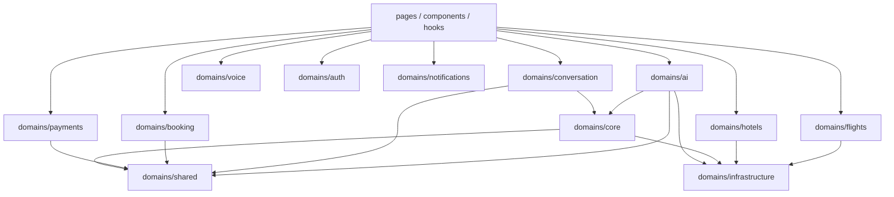

# Dependency Graph

## Enforcement

```bash
npm run arch:circular   # zero-dep cycle detector — must report 0 cycles
```

Status after architecture DDD pass: **0 circular dependencies** under `src/`.

## Target dependency direction



## Forbidden edges

- `core` → `pages` / `components`
- `infrastructure` → UI
- Feature domain → another feature’s **private** files (use public `index.ts` only)
- Adapter/mock modules → fat `utils/contracts` barrel (use leaf `providers` / `models` / `result`)
- Orchestrator types → `brain/integration.ts` (use `integrationTypes.ts`)

## Historical cycles (resolved)

| Former cycle | Resolution |
|--------------|------------|
| `travelSession` ↔ `requirementAnalyzer` | `travelSessionTypes.ts` leaf |
| `searchOrchestrator` ↔ mocks ↔ `toSearchResult` | `providerSearchResult.ts` leaf |
| contracts barrel ↔ integrations registry | Adapters/mocks import leaf contract paths |
| `bookingFlow` ↔ `brain` barrel | Deep imports + conversationMemory leaf |
| `integration` ↔ `aiTripOrchestrator` | `integrationTypes`, `orchestrator/reset`, `sessionRegistry` |

## Runtime vs façade

UI may still import `src/lib/*` directly during migration. New code should prefer `src/domains/<domain>`. Façades re-export implementations; they do not duplicate logic.
