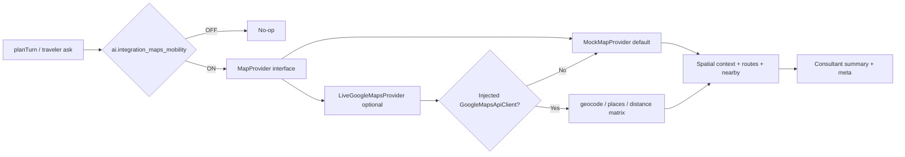

# Maps & Live Mobility — Provider Diagram (Sprint 8)

**Draft PR:** _(pending)_

---

## Map Provider Abstraction

---

## Capabilities

| Capability | Mock | Live (injected) |
|---|---|---|
| Geocode | yes | yes (fallback mock) |
| Reverse geocode | yes | yes |
| Nearby | curated catalog | place search |
| Route + modes | haversine ETA | distance matrix |
| Leave-by | yes | yes |
| GPS hardware | no | no |
| UI map canvas | no | no |
