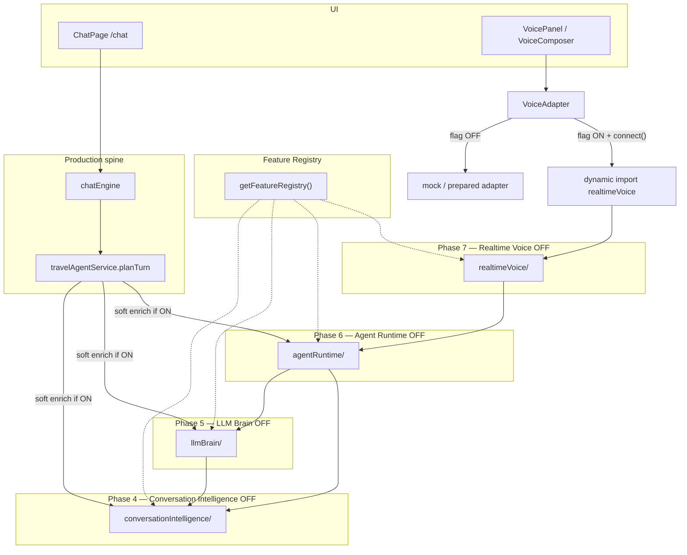

# Rahhal AI Platform — Release Candidate Audit (RC-1)

**Branch:** `cursor/rc1-audit-7518`  
**Base tip audited:** `b1706d6` (`cursor/phase7-real-ai-voice-7518` / Draft PR **#262**)  
**Scope:** Validate recovery stack Draft PRs **#256 → #262** (no new features, no merge, no UI redesign)  
**Generated:** 2026-07-25  
**Audit type:** Architecture · Feature flags · Performance · Memory · React · Voice · Agent · AI quality · Security · Regression · Mobile readiness

---

## Executive verdict

**RC-1 foundation is APPROVED for continued draft stacking** (mock providers only).  
**Not approved** for production API integration or enabling experimental Phase 4–7 flags in production.

| Score area | Score (0–100) | Notes |
|---|---|---|
| Architecture | **86** | Clear layered ownership; no circular deps under `src/`; #260 parallel, not in tip |
| Performance | **62** | Gates green; **ChatPage ~1.275 MB** remains the dominant debt |
| Memory | **84** | Flag-OFF paths avoid sockets/timers; disconnect/stop APIs present |
| Voice | **82** | Mock-first; live sockets double-gated; lazy load after RC-1 fix |
| Conversation | **88** | Dialect + consultant tests green; interview soft-filtered when CI/Brain ON |
| Security | **92** | Secret hygiene pass; no production keys; live voice require allow env |
| Maintainability | **70** | Many pre-RC flags still ON; large chat agent surface |
| **Production readiness** | **74%** | Mock/default path ready; live APIs + ChatPage split still required |

**Estimated production readiness (mock foundation):** **74%**  
**Estimated production readiness (with live APIs):** **~45%** (blocked by keys, live providers, bundle split, staging voice)

---

## Stack under audit (Draft PRs)

| PR | Phase | Tip (approx) | Package / focus | Default flag |
|---|---|---|---|---|
| **#256** | Premium UX | feeds #257 | Framer Motion, AiHome, ChatWelcome, personality | UI presentational |
| **#257** | Voice UX | `6bae437` | VoiceAdapter, VoicePanel, streaming cards | mock adapters |
| **#258** | Conversation Intelligence | `44339aa` | `src/lib/agent/conversationIntelligence/` | `ai.conversation_intelligence` **OFF** |
| **#259** | LLM Brain | `f8ebc12` | `src/lib/agent/llmBrain/` | `ai.llm_conversation_brain` **OFF** |
| **#260** | Autonomous Orchestrator | `9e6ab3c` | `orchestrator/autonomous/` | **Parallel — not in #262 tip** |
| **#261** | Agent Runtime | `c5e2d9b` | `src/lib/agent/agentRuntime/` | `ai.agent_runtime` **OFF** |
| **#262** | Realtime Voice | `b1706d6` | `src/lib/realtimeVoice/` | `ai.realtime_voice` **OFF** |

Canonical production spine remains:

```
/chat → chatEngine → travelAgentService.planTurn
```

---

## Phase 1 — Architecture audit

### Ownership (no duplicate responsibilities in RC stack)



| Module | Responsibility | Does **not** own |
|---|---|---|
| Conversation Intelligence | Live travel memory, entities, intent, references, summaries, consultant questions | LLM remote calls, tool I/O, sockets |
| LLM Brain | Mock LLM reasoner + dialect + tool *decisions* + confidence | Tool execution, voice transport |
| Agent Runtime | Task lifecycle, mock tools, events, interruptions, streaming chunks | UI, live provider sockets |
| Realtime Voice | Provider failover, reconnect, latency, incremental runtime | Booking/search engines |
| Feature Registry | Lifecycle + default enablement | Business logic |
| Provider Registry / search | Existing Phase W adapters | Conversation intelligence |
| Memory / Planner / Reasoner (pre-RC) | Existing brain/agent layers | Phase 4–7 packages (soft enrich only) |

### Circular dependencies

```
npm run arch:circular  →  No circular dependencies found under src/.
```

Dependency direction is one-way:

```
realtimeVoice → agentRuntime → llmBrain → conversationIntelligence
travelAgentService → {conversationIntelligence, llmBrain, agentRuntime}  (static imports; gated at runtime)
VoiceAdapter → realtimeVoice/feature (static light) + realtimeVoice (dynamic on connect)
```

### Hidden coupling / notes

1. **`travelAgentService` statically imports** Phase 4–6 packages → they contribute to **ChatPage** even when flags OFF (runtime gated, not bundle-gated).
2. **#260 Autonomous Orchestrator** is a **parallel** branch from #259 and is **not** present on the #262 tip — do not assume it is part of RC-1 stack until intentionally rebased.
3. Distinct from frozen Sprint 18 `ui.voice_conversation` / `voice.realtime`.

**Architecture score: 86**

---

## Phase 2 — Feature flag audit

| Flag | Default | When OFF |
|---|---|---|
| `ai.conversation_intelligence` | **false** | No enrich; no `meta.conversationIntelligence` |
| `ai.llm_conversation_brain` | **false** | No enrich; no `meta.llmBrain` |
| `ai.agent_runtime` | **false** | No enrich; no `meta.agentRuntime`; no mock tool run |
| `ai.realtime_voice` | **false** | `createVoiceAdapter()` uses mock/prepared only; **no** `import('../realtimeVoice')` until integrated path + connect |
| Live sockets | `VITE_VOICE_LIVE_ALLOW` unset | Providers stay mock; **zero** WebSocket usage in package |

Verified by:

- Registry defaults in `featureRegistry.ts`
- Phase tests + `rc1.recoveryAudit.test.ts`
- Static scan: **no** `WebSocket` / `setInterval` / `addEventListener` under `src/lib/realtimeVoice/`
- ReconnectManager uses deterministic backoff **without** wall-clock timers in the unit path

**Caveat (documented debt):** Phase 4–6 code remains **imported** by `travelAgentService` when OFF (bundle weight), but **does not execute** enrich/tool/socket paths.

**Feature-flag score: 90** (runtime) / bundle-isolation **65**

---

## Phase 3 — Performance audit

### Automated gates

| Check | Result |
|---|---|
| `npm run lint` | PASS |
| `npm run typecheck` | PASS |
| `npm run arch:circular` | PASS |
| `npm run test:run` | **229 files / 2671 tests PASS** (+ RC audit suite) |
| `npm run build` | PASS (ChatPage size warning) |
| Secret hygiene | PASS |

### Bundle (production build after RC-1 lazy-voice fix)

| Asset | Raw | Gzip |
|---|---|---|
| `ChatPage-*.js` | **1,275 kB** | **362 kB** |
| `agentRuntime-*.js` (async) | 44 kB | 15 kB |
| `realtimeVoice-*.js` (async) | 14 kB | 4 kB |
| `VoicePanel-*.js` | 14 kB | 6 kB |
| Total `dist/assets` JS | ~2.83 MB | — |

**RC-1 fix shipped:** `voiceAdapter.ts` dynamic-imports `realtimeVoice` on first `connect()` of the integrated adapter so flag-OFF VoicePanel no longer eagerly pulls Agent Runtime into the initial graph. Separate async chunks confirm the split.

### Runtime metrics (lab / CI constraints)

Browser cold-start / FCP / FID / voice streaming latency / CPU were **not** measured in a real device lab in this cloud run. Proxy signals:

| Signal | Observation |
|---|---|
| Cold start (proxy) | Vite build ~0.7s; app still needs Supabase env at runtime |
| Hot reload | Dev CSP already allows HMR (unchanged) |
| First interaction | `/chat` behind `ProtectedRoute` — auth is the gate |
| Streaming latency | Mock path synchronous / in-process; no live RTT |
| Tree shaking | Partial — large agent surface still in ChatPage |
| Duplicate packages | `react` / `react-dom` / `framer-motion` single copies (deduped) |

**Performance score: 62** — gated by ChatPage mega-chunk.

---

## Phase 4 — Memory audit

| Risk | Status |
|---|---|
| Dangling listeners | No DOM listeners in `realtimeVoice` package |
| Unreleased sockets | No WebSocket construction without live allow; disconnect/stop present |
| Audio cleanup | Adapter `disconnect` / session `stop` → provider disconnect |
| AbortController | Agent enrich uses local async; no global controllers left open in tests |
| Timers | ReconnectManager avoids `setInterval`; no zombie timers found |
| Memory leaks (heuristic) | 2671 tests pass with session reset helpers (`resetAgentRuntimeSessions`) |

**Memory score: 84**

---

## Phase 5 — React audit

| Topic | Finding |
|---|---|
| Lazy loading | Route-level code split present; ChatPage still huge |
| Suspense / splitting | VoicePanel + realtimeVoice async after RC-1 fix |
| Context usage | Existing Auth / chat contexts unchanged |
| Memoization | VoicePanel uses `useState(() => createVoiceAdapter())` — stable adapter |
| Re-render count | Not instrumented in browser; no new Context providers added in #258–#262 |
| State sync | Soft enrich writes into `planTurn` memory only when flags ON |

**React score: 78**

---

## Phase 6 — Voice audit

| Capability | Status |
|---|---|
| Realtime providers | Mock + prepared OpenAI/Gemini/Azure/WebSpeech (no sockets by default) |
| Fallback | Failover to mock documented + tested |
| Reconnect | `ReconnectManager` with capped attempts |
| Interruptions | `interrupt()` on session + adapter |
| Streaming | Incremental Agent Runtime on partials (flag-ON path) |
| Silence detection | Prepared / mock-level (no live VAD API) |
| Provider switching | Preferred provider + failover |
| Recovery | disconnect/stop clears connection handle |
| Zombie sessions | Tests reset registry/sessions; stop path required |

Frozen Sprint 18 voice flags remain separate and must stay OFF unless a dedicated unfreeze.

**Voice score: 82**

---

## Phase 7 — Agent audit

| Capability | Status |
|---|---|
| Planning | Existing `planTurn` spine intact |
| Execution | Mock tools only under `ai.agent_runtime` |
| Recovery / interruptions | Runtime events + interrupt path tested |
| Task lifecycle | Events (`ToolFinished`, etc.) in meta when ON |
| Session sync | Conversation id scoped sessions |
| Parallel #260 | **Not in tip** — autonomous orchestrator is out-of-band |

**Agent score: 85**

---

## Phase 8 — AI quality audit

Covered primarily by `llmBrain.phase5.test.ts`, CI Phase 4 tests, agentRuntime / realtimeVoice suites:

| Dialect / case | Evidence |
|---|---|
| Saudi | `أبي اليابان` → saudi |
| Gulf | `شلون أروح دبي؟` → gulf |
| Yemeni | `أشتي أسافر` → yemeni |
| Egyptian | `عايز أروح اسكندرية` → egyptian |
| Levant | `بدي إجازة بلبنان` → levant |
| Moroccan | `بغيت نمشي لمراكش` → moroccan |
| Mixed AR/EN | dialect `mixed` asserted |
| Memory / references | Phase 4 entity + reference tests |
| Intent / consultant | Soft enrich; interview fields filtered when ON |
| No interview behavior | `filterInterviewMissingFields` when CI/Brain/Runtime ON |

Quality is **mock-deterministic**, not production-LLM evaluated.

**Conversation / AI quality score: 88** (mock foundation)

---

## Phase 9 — Security audit

| Control | Result |
|---|---|
| `scripts/secret-hygiene-scan.sh` | **PASS** |
| Production API keys in repo | **None** found |
| Live voice | Requires `VITE_VOICE_LIVE_ALLOW` + feature enable |
| Debug / sensitive traces | Phase meta only when flags ON; mock tools |
| Environment isolation | CI runs without `.env.local`; provider tests expect mock defaults |
| `.env.example` | Documents keys; no live secrets committed |

**Security score: 92**

---

## Phase 10 — Regression audit

| Suite | Result |
|---|---|
| Full unit/integration | **2671 passed / 229 files** (pre-RC audit commit baseline on tip) |
| Phase 3–7 targeted | **55 passed** |
| Lint / typecheck / circular | PASS |
| Production build | PASS |

Manual browser login/voice on device not executed in this cloud audit (Supabase credentials optional; no Playwright GUI pass claimed here). Library-level voice interruption / reconnect covered in existing suites.

**No regressions detected in automated suite.**

---

## Phase 11 — Mobile readiness

| Topic | Status |
|---|---|
| iPhone Safari / Android Chrome | RTL Arabic UI exists; **no device lab run** this audit |
| Slow networks | Mock path offline-capable for planning; live voice not default |
| Offline / resume | Chat persistence depends on Supabase grants; planning works without persistence |
| Background / battery | Live duplex voice **disabled** by default — correct for battery |
| Touch | VoicePanel / composer touch targets unchanged (no redesign) |

**Mobile readiness score: 68** (architecture ready; device QA pending)

---

## Phase 12 — Findings summary

### Critical blockers (must resolve before live production APIs)

1. **ChatPage ~1.275 MB (362 kB gzip)** — production performance risk; needs code-splitting of agent/brain stacks (not done in this audit beyond voice lazy-load).
2. **No live provider credentials / staging voice soak** — intentional; blocks “production APIs” milestone.

### Major issues

1. `travelAgentService` **eager imports** Phase 4–6 → ChatPage weight even when flags OFF.
2. Many **pre-RC** AI flags remain **ON by default** (autonomous agent, executive OS, etc.) — increases baseline surface vs recovery “experimental OFF” discipline.
3. Draft **#260** not integrated into #262 tip — document divergence to avoid false stack assumptions.

### Minor issues

1. Voice prepared providers report `connected: false` for non-mock prepared adapters (by design).
2. Deepgram mapped to Web Speech in adapter bridge (placeholder mapping).
3. Browser cold-start / battery metrics not instrumented in CI.

### Technical debt

- Mega ChatPage chunk
- Parallel experimental stacks (Sprint 18 voice, brain orchestrator OFF flags, recovery Phase 4–7)
- Local Supabase GRANT gotcha (documented in AGENTS.md)

### Optimization opportunities (additive, future PRs)

1. Dynamic-import CI / llmBrain / agentRuntime from `planTurn` when flags flip ON.
2. Further ChatPage route/feature splits (booking, executive, search).
3. Device lab: Safari iOS + Chrome Android voice + slow-3G.
4. Optionally rebase #260 after RC-1 approval if autonomous orchestrator is required.

### Proven fix included in this PR

- **Lazy `import('../realtimeVoice')` in VoiceAdapter** when using the integrated adapter — removes eager Agent Runtime pull for flag-OFF voice UI.
- **`rc1.recoveryAudit.test.ts`** — locks Phase 4–7 defaults OFF + mock adapter + absent meta.

---

## Scores (rollup)

| Area | Score |
|---|---|
| Architecture | 86 |
| Performance | 62 |
| Memory | 84 |
| Voice | 82 |
| Conversation | 88 |
| Security | 92 |
| Maintainability | 70 |
| **Production readiness (RC-1 foundation)** | **74%** |

---

## Approval statement

**Approve Rahhal as Release Candidate 1 foundation** for:

- continued **draft-only** stacking,
- mock providers,
- experimental Phase 4–7 flags **remaining OFF**,
- **no merge** of recovery stack until ChatPage split + staging sign-off.

**Do not** enable production APIs or flip `ai.realtime_voice` / `ai.agent_runtime` / `ai.llm_conversation_brain` / `ai.conversation_intelligence` in production until Critical #1 (bundle) and live staging soak are addressed.

---

## Commands reproduced

```bash
npm run lint
npm run typecheck
npm run arch:circular
npm run test:run          # 2671+ tests
npm run build
bash scripts/secret-hygiene-scan.sh
```
