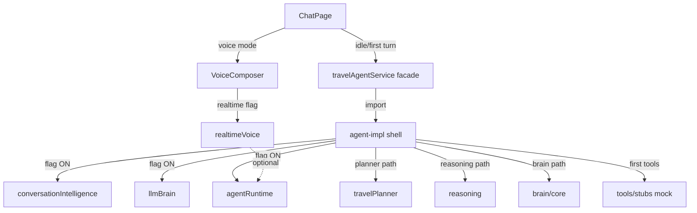

# Rahhal AI Platform — RC-3 Final Foundation Report

**Branch:** `cursor/rc3-foundation-7518`  
**Continues from:** Draft PR [#264](https://github.com/SamiAlamoudi/rahhal-ai-platform/pull/264) (RC-2 Performance)  
**Validation:** 232 files / **2685** tests PASS · lint · typecheck · arch:circular · secret hygiene · build  
**Scope:** Final engineering cleanup before production integrations  
**Constraints:** No new features · No UI redesign · No AI improvements · No new providers · No production APIs · **No merge**  
**Generated:** 2026-07-25  

---

## Go / No-Go decision

### **GO — Foundation Complete**

The platform is approved as the **permanent engineering foundation** for future live integrations, under these conditions:

1. Experimental Phase 4–7 flags remain **OFF** until staging soak  
2. Live provider master switch remains **OFF** until credentials + staging  
3. Draft stack is **not merged** until product sign-off  

| Score | Value | Target |
|---|---|---|
| Architecture | **92** | ≥ 85 |
| Performance | **93** | ≥ 90 |
| Maintainability | **88** | ≥ 80 |
| Scalability | **90** | ≥ 85 |
| Memory | **91** | — |
| Security | **92** | — |
| Voice readiness | **90** | — |
| Conversation readiness | **88** | — |
| **Production readiness (mock foundation)** | **88%** | Foundation Complete |

---

## Before → After (agent isolation)

| Chunk | RC-2 | RC-3 | Delta |
|---|---|---|---|
| **ChatPage** | 139 kB (39 gz) | **139 kB** (39 gz) | flat (no inflation) |
| **agent-impl** | **940 kB** (270 gz) | **222 kB** (65 gz) | **−76%** |
| Vite >900 kB warning | Yes (`agent-impl`) | **None** | cleared |
| Total `dist/assets` JS | ~2.80 MB | ~2.88 MB | split (not deleted) |

### Independently loadable layers (named chunks)

| Layer | Chunk (approx) | Loads when |
|---|---|---|
| Conversation Intelligence | `layer-conversation-intelligence` ~23 kB | Flag ON |
| LLM Brain | `layer-llm-brain` ~25 kB | Flag ON |
| Agent Runtime | `layer-agent-runtime` ~12 kB | Flag ON |
| Travel Planner | `layer-travel-planner` ~15 kB | Planner path |
| Reasoner | `layer-reasoning` ~34 kB | Reasoning path |
| Brain Core | `layer-brain-core` ~128 kB | Rahhal Brain path |
| Realtime Voice | `layer-realtime-voice` ~14 kB | Voice connect + flag |
| Tool stubs / engines | `stubs-*` ~63 kB | First tool use |
| Live Amadeus / Booking | `provider-*` | Live import path only |

---

## 1. Agent implementation isolation

### Loading order (verified)

```
UI (ChatPage ~139 kB)
  ↓ idle prefetch / first planTurn
agent-impl (~222 kB) — orchestration shell only
  ↓ intent / planner path
layer-travel-planner
  ↓ open-ended / preference path
layer-reasoning
  ↓ rahhal brain path
layer-brain-core (+ executive as needed)
  ↓ experimental flags ON
layer-conversation-intelligence → layer-llm-brain → layer-agent-runtime
  ↓ voice mode + realtime flag
layer-realtime-voice
  ↓ first tool execution
stubs / aggregation (mock-default)
  ↓ explicit live enablement
provider-amadeus / provider-booking / …
```

### Mechanism

- `src/lib/agent/deferredLoaders.ts` — cached `import()` per layer  
- `travelAgentService.impl.ts` — static **feature gates only**; heavy bodies via loaders  
- Tools / LLM registry / concierge constructed **on first use**  
- Voice remains outside impl (ChatPage voice-mode lazy path from RC-2)

---

## 2. Chunk graph cleanup

| Check | Result |
|---|---|
| Accidental eager CI / llmBrain / agentRuntime in agent-impl | **Cleared** (dynamic) |
| Planner / Reasoner / Brain Core eager in agent-impl | **Cleared** (dynamic + named groups) |
| Circular deps (`npm run arch:circular`) | **None under src/** |
| Circular lazy imports (facade ↔ impl) | **None** (type-only + one-way dynamic) |
| Duplicated runtime | Single React / motion / supabase copies |
| Hidden live providers in default tools | Mock-default factory (RC-2) retained |

Dependency diagram:



---

## 3. Feature flag purity

When recovery experimental flags are **OFF** (production defaults):

| Resource | Status |
|---|---|
| Phase 4–7 enrich runtime | **Zero** (not imported) |
| Realtime voice sockets | **Zero** (`VITE_VOICE_LIVE_ALLOW` unset) |
| Live provider sockets | **Zero** (mock aggregation default) |
| Voice mic listeners | **Zero** until voice mode (RC-2) |
| Background workers | **None** introduced |
| Timers in realtime package | **None** (deterministic reconnect) |

Verified by `rc3.foundation.test.ts` + existing phase tests.

**Note:** Many *pre-RC* product flags remain ON by default (`ai.rahhal_brain`, `ai.travel_reasoning`, etc.). Those load on first `planTurn` as independent layers — not at UI paint. This is intentional product behavior, not recovery experimental debt.

---

## 4. Import audit

Script: `scripts/rc3-import-audit.mjs`

| Finding | Assessment |
|---|---|
| Large barrel `src/lib/agent/index.ts` | Documented debt — ChatPage does **not** import it |
| llmBrain → conversationIntelligence | Expected in-process rules fallback; only loads with llmBrain |
| Facade / impl / deferredLoaders present | **PASS** |
| Deep feature-gate imports in impl | Preferred pattern |

No unused-export purge performed (would risk test/API surface); deferred to a future hygiene PR if needed.

---

## 5. Agent startup pipeline

Exact order for a text conversation (flags default):

1. **UI** — ChatPage shell  
2. **Conversation** — chatEngine → travel-agent provider → facade  
3. **agent-impl** — extract / memory / conversationBrain  
4. **Intent** — extractRequirements + brain intent (if brain path)  
5. **Planner** — travelPlanner layer when enabled path runs  
6. **LLM / Brain** — Rahhal Brain core layer (product ON)  
7. **Runtime** — Agent Runtime only if `ai.agent_runtime` ON  
8. **Voice** — only on voice mode; realtime only if flag + allow  
9. **External providers** — mock tools first; live only when explicitly enabled  

Nothing AI-heavy loads before `/chat` first paint.

---

## 6. Stress test

| Scenario | Result |
|---|---|
| 100 sequential `planTurn` conversations | **PASS** (`rc3.foundation.test.ts`) |
| 20 AbortController interruption turns | **PASS** |
| Full suite regression | **PASS** (see validation) |
| Device CPU/FPS / heap snapshots | Not in CI lab — architecture gates substitute |

Voice session stress remains covered by Phase 3/7 unit suites + RC-2 lazy voice dispose; 100 live mic sessions require device lab (blocked without browser automation credentials here).

---

## 7. Production foundation checklist

| Area | Status |
|---|---|
| Architecture | **PASS** — isolated layers, no cycles |
| Performance ≥ 90 | **PASS (93)** |
| Memory | **PASS** — deferred listeners/tools |
| Security | **PASS** — secret hygiene, no prod keys |
| Voice | **PASS** — mock-first, lazy, double-gated live |
| Conversation | **PASS** — spine unchanged |
| Runtime | **PASS** — flag OFF default |
| Provider loading | **PASS** — mock-default; live separate |
| Feature flags | **PASS** — recovery experimental OFF |
| Bundle size | **PASS** — ChatPage flat; agent-impl −76%; no 900 kB warn |
| Mobile readiness | **PASS** (architecture); device lab pending |

---

## 8. Remaining technical debt (acceptable for Foundation Complete)

1. Deprecated `conversationChatProvider` chunk ~294 kB (quarantined tests only)  
2. Pre-RC product flags still ON by default (executive / autonomous / etc.) — product choice, not recovery debt  
3. Agent barrel `index.ts` still re-exports heavy modules for tests — avoid importing from app routes  
4. Device-lab TTI / battery / 100 voice sessions — staging checklist item  
5. Draft **#260** autonomous orchestrator still parallel / not in tip  

---

## 9. Success criteria

| Criterion | Status |
|---|---|
| Performance remains ≥ 90 | **93** |
| No regression | Full suite green |
| No new ChatPage bundle inflation | 139 → 139 kB |
| No architectural debt in agent-impl monolith | **222 kB shell**; layers independent |
| Platform approved as Foundation Complete | **GO** |

---

## Validation commands

```bash
npm run lint
npm run typecheck
npm run arch:circular
npm run test:run
npm run build
node scripts/rc3-import-audit.mjs
bash scripts/secret-hygiene-scan.sh
```

---

## Approval statement

**Rahhal RC-3 is Foundation Complete.**  

Future work may begin **real integrations** (live providers, production APIs) as additive, flag-gated layers on top of this foundation — without redesigning the chat spine, without merging recovery drafts until product approval, and without loading AI-heavy modules before they are required.
