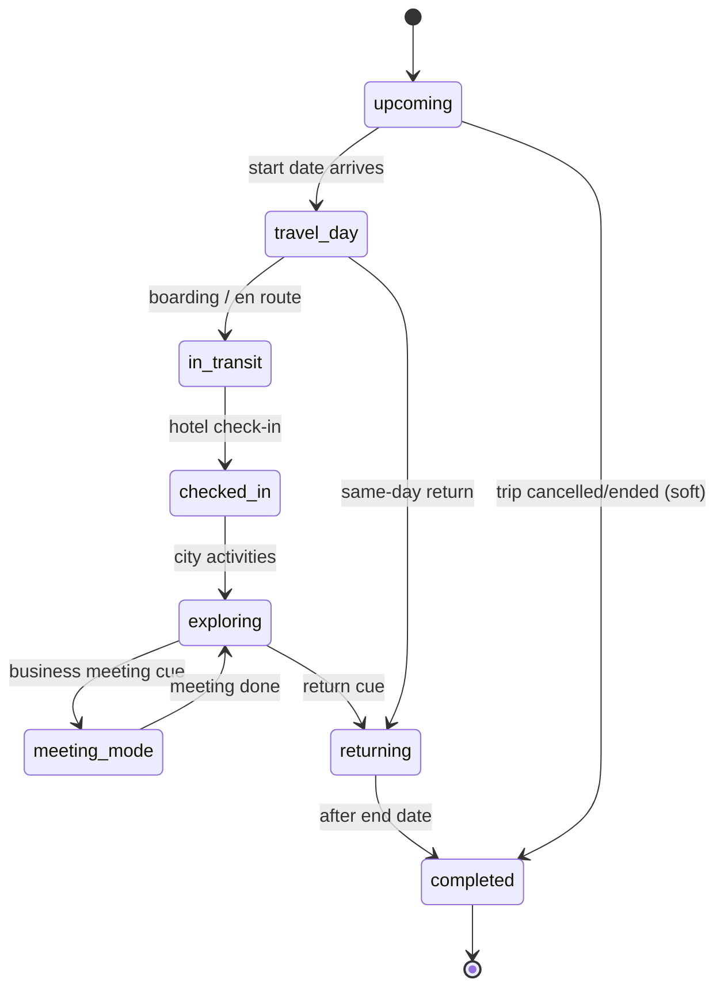
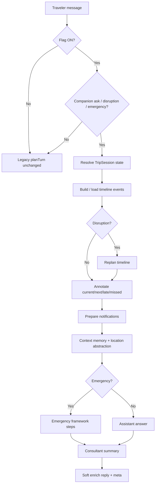

# Live Trip Companion — Lifecycle Diagram (Sprint 7)

**Draft PR:** _(pending)_

---

## TripSession states

---

## Runtime loop

---

## Timeline status legend

| Status | Meaning |
|---|---|
| upcoming | Not started |
| current | In progress |
| late | Overdue / cutting it close |
| missed | Window passed |
| skipped | Traveler skipped |
| rescheduled | Moved by replan |
| done | Completed window |
