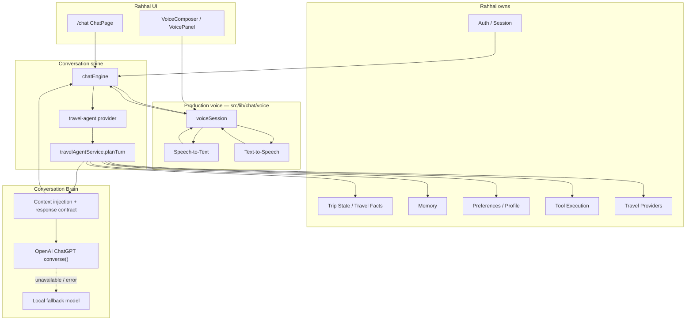

# Conversation-First Architecture

> This document describes work completed before the product was renamed to Bilamo.
> Active product brand: **Bilamo / بيلامو**. Historical “Rahhal” names below are archival.

Bilamo is a Conversation-First AI Travel Consultant.
**Bilamo is the product.** OpenAI ChatGPT is the intelligence and speaking engine behind Bilamo.

## Responsibility split

| Owner | Responsibilities |
| --- | --- |
| **Rahhal** | Trip State, Memory, Conversation Context, Tool Execution, Travel Providers, UI, Authentication, User Profile, Session Management |
| **OpenAI ChatGPT** | Thinker, Planner (dialogue), Conversation engine, Speaker (spokenText), Travel consultant language |

Before every OpenAI request, Rahhal injects:

1. Current trip state / Travel Facts
2. Memory
3. Travel preferences
4. Conversation context (recent turns + objective)
5. Response contract (Advance / Collect / Recommend / Confirm / Execute)

## Production pipeline

```text
Microphone
    ↓
Speech-to-Text          (src/lib/chat/voice/webSpeechToTextProvider)
    ↓
Conversation Context    (chatEngine + Travel Facts + memory + preferences + response contract)
    ↓
OpenAI ChatGPT API      (conversationBrain → openaiLlmAdapter.converse)
    ↓
Assistant Response      (displayText + spokenText JSON)
    ↓
Text-to-Speech          (OpenAI `/api/openai/tts` via audio element; Edge backup after failures)
    ↓
IDLE                    (mic stays IDLE — no auto-relisten; user taps mic for the next turn)
```

Text turns skip Mic/STT/TTS and enter at Conversation Context.

## Module map



## Canonical code paths

| Concern | Path |
| --- | --- |
| Chat UI | `src/pages/ChatPage.tsx` |
| Turn owner | `travelAgentService.planTurn` |
| Dialogue author | `src/lib/agent/conversationBrain/` |
| OpenAI adapter | `src/lib/agent/llm/openaiLlmAdapter.ts` |
| LLM factory | `src/lib/agent/llm/factory.ts` (OpenAI when key present) |
| System prompt + injection | `src/lib/agent/conversationBrain/systemPrompt.ts` |
| Voice session | `src/lib/chat/voice/voiceSession.ts` |
| Trip / memory facts | `src/lib/agent/conversationBrain/travelFacts.ts`, `src/lib/agent/memory.ts` |

## Voice product requirements (production)

- Natural conversation via short `spokenText`
- Streaming assistant UI via chatEngine deltas
- Explicit interrupt via mic tap / stop (server `interrupt_response: false` — no soft duplex barge-in)
- After assistant reply or playback completes, microphone state is **IDLE** (not LISTENING)
- Next listening turn starts only after an explicit user mic press
- Home Realtime path: WebRTC STT + `speakWrittenDraft`; classic `/chat` path: browser STT → same `planTurn` → audio-element TTS

## Explicitly out of product spine

- Soft duplex barge-in / listen-while-speaking (optional future, flag-OFF)
- Automatic hands-free relisten after every reply (removed post-#311)
- OpenAI Realtime inventing assistant replies (Realtime is transport + STT/TTS only)
- Sprint 18 `voiceConversation` orb runtime
- Phase 5 `llmBrain` / Phase 6 `agentRuntime` soft-enrich
- Voice Preview / Trace / Debug Overlay / JSON evidence panels
- Mock duplex “live” voice adapters as product conversation owners
