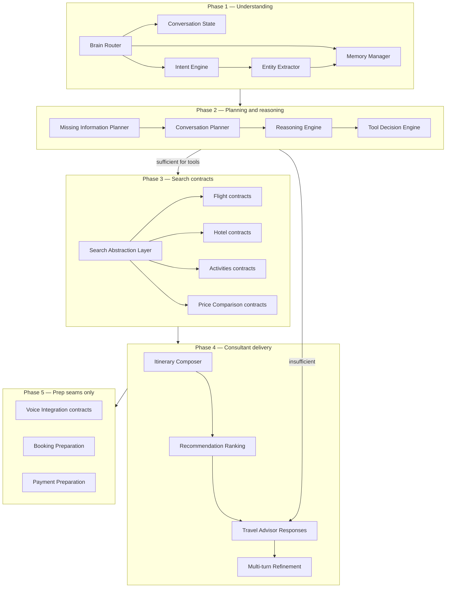

# Sprint 89 — AI-First Architecture Revision

**Status:** Design only — not implemented · no production code · no commits required for this artifact  
**Baseline:** Sprint 88 COMPLETE (`sprint88-complete` @ main) · Architecture Gate PASS  
**Supersedes for forward planning:** ADD §19 “Sprint 89 — Reasoning Engine vNext” (narrow reasoner-only framing)  
**Does not reopen:** Historical `docs/SPRINT89_ARCHITECTURE_IMPACT.md` (pre–Brain Foundation blocker-fix sprint; archive context only)  

**Non-negotiables**

| Rule | Requirement |
| --- | --- |
| Product stance | Intelligent **travel consultant**, not a booking workflow |
| Conversation | Conversation-first only · **no booking forms** |
| Voice + text | **One shared planner** under `travelAgentService.planTurn` |
| Questions | AI decides missing info · ask **minimum** necessary follow-ups (≤1 / turn when needed; 0 when enough) |
| Flags | `ai.brain.v1` OFF · `ai.brain.v1.preview` OFF · no `ai.tie.v1` |
| Forbidden in Sprint 89 delivery | Provider execution · booking execution · payment execution · production flag enablement |
| Recovery | `RECOVERY_TURN_OWNER = travelAgentService.planTurn` unchanged |

Sprint 88 already shipped: Preview Orchestrator contracts, memory adapters (unwired), DomainIntelligence / ranking / NormalizedOffer interfaces, golden evals G01–G05, shadow telemetry skeleton, Search Handoff ADR (Option A; clarify-before-search). Sprint 89 **extends intelligence under the freeze**; it does **not** rebuild L1 conversation policies already shipped (ConversationManager, ValueFirstPlanner, ClarificationPolicy).

---

## 0. Product thesis

Rahhal must:

1. Understand the traveler’s goal from natural language (and voice transcripts into the same turn).  
2. Maintain memory and provenance across turns.  
3. Reason about destinations, style, constraints, and tradeoffs.  
4. Decide **whether** tools/search are justified — and **refuse search** when information is insufficient (ADR Sprint 88).  
5. Deliver consultant value first: advice, shortlists, itinerary direction, explainable alternatives.  
6. Defer passport, identity, payment, and booking mechanics until the traveler explicitly moves toward booking (Phases 5 — preparation only in 89).

Rahhal must **not**:

- Drive a form-first or multi-field booking intake.  
- Depend on a separate voice planner.  
- Call providers, create bookings, or collect payments in Sprint 89.  
- Silently fail or expose provider/raw errors.

---

## 1. Updated architecture diagram

### 1.1 End-to-end (AI-first consultant)

```text
┌──────────────────────────────────────────────────────────────────────────┐
│ Traveler                                                                  │
│  Text (/chat)  ·  Voice input (STT → same user text turn)                 │
└─────────────────────────────────┬────────────────────────────────────────┘
                                  │
┌─────────────────────────────────▼────────────────────────────────────────┐
│ Conversation Spine (FROZEN)                                               │
│  chatEngine → travel-agent provider → planTurn                            │
│  Preview soft-wire remains behind ai.brain.v1.preview (OFF)               │
└─────────────────────────────────┬────────────────────────────────────────┘
                                  │
          ┌───────────────────────┼───────────────────────┐
          │ preview OFF / prod    │ preview ON (non-prod) │
          ▼                       ▼                       │
   Current Planner         Preview Orchestrator           │
                           (BrainRouter+)                 │
                                  │                       │
┌─────────────────────────────────▼───────────────────────────────────────┐
│ PHASE 1 — Understanding core                                              │
│  Brain Router · Conversation State · Memory Manager                       │
│  Intent Engine · Entity Extractor                                         │
└─────────────────────────────────┬───────────────────────────────────────┘
                                  │
┌─────────────────────────────────▼───────────────────────────────────────┐
│ PHASE 2 — Planning & reasoning                                            │
│  Missing Information Planner · Conversation Planner                       │
│  Reasoning Engine · Tool Decision Engine                                  │
│  (clarify-before-search gate is HARD)                                     │
└─────────────────────────────────┬───────────────────────────────────────┘
                                  │
                    ┌─────────────┴─────────────┐
                    │ sufficient?               │
                    ▼                           ▼
              clarify ≤1 Q              PHASE 3 — Search contracts
              + value-first             (interfaces / mocks only)
                                        Search Abstraction Layer
                                        Flight · Hotel · Activities
                                        · Price Comparison contracts
                                              │
                                              ▼
┌─────────────────────────────────────────────────────────────────────────┐
│ PHASE 4 — Consultant output                                               │
│  Itinerary Composer · Recommendation Ranking                              │
│  Travel Advisor Responses · Multi-turn Refinement                         │
└─────────────────────────────────┬───────────────────────────────────────┘
                                  │
┌─────────────────────────────────▼───────────────────────────────────────┐
│ PHASE 5 — Future seams (prep only; no execution)                          │
│  Voice Integration contracts · Booking Preparation · Payment Preparation  │
└─────────────────────────────────────────────────────────────────────────┘

AgentMemory (SoT) ←── Memory adapters / provenance (Sprint 88+)
Destination Knowledge + Explainability (Sprint 87+) ←── Reasoning / Ranking
Shadow telemetry + Golden evals (Sprint 88) ←── quality gates (default OFF)
```

### 1.2 Phase dependency graph



### 1.3 Mapping to existing codebase (reuse, do not fork)

| Architecture module | Existing foundation (prefer extend) |
| --- | --- |
| Brain Router | `src/lib/brain/v1/preview/BrainRouter.ts` + Sprint 88 preview contracts |
| Conversation State | ConversationManager session + preview `sessionStore` |
| Memory Manager | Sprint 88 `preview/memory/*` adapters over `AgentMemory` |
| Intent / Entity | Brain v1 `IntentDetector` / `EntityExtractor` |
| Missing Information Planner | ClarificationPolicy + ToolMissingFields + ConfidenceEngine |
| Conversation Planner | ConversationPlanner + ValueFirstPlanner |
| Reasoning Engine | TravelReasoner + Destination Knowledge + traces |
| Tool Decision Engine | ToolDecisionEngine + Sprint 85 execution engine (gated) |
| Search Abstraction | Sprint 88 `DomainIntelligence` + `NormalizedOffer` + existing `src/core/providerGateway` **types only** in Phase 3 |
| Ranking / XAI | `RankingConfig` + RecommendationEngine + Explainability |
| Voice | Existing browser STT → same `planTurn` text path; Phase 5 = contracts only |
| Booking / Payment | Out of execution; Phase 5 preparation interfaces only |

---

## 2. Sprint breakdown (phased)

Sprint 89 is delivered as **five sequential phases**. Each phase is independently reviewable; later phases must not start until the prior phase DoD is met. **No production flag enablement in any phase.**

### Phase 1 — Understanding core

**Goal:** Strengthen the shared understanding path used by text and voice transcripts.

| Work | Detail |
| --- | --- |
| Brain Router | Evolve Preview Orchestrator contracts; still early-return unless later handoff; no new turn owner |
| Conversation State | Harden session continuity / stage model alignment with ADD state machine |
| Memory Manager | Wire adapters **only behind preview test paths / explicit deps** — default product path unchanged when flags OFF |
| Intent Engine | Improve intent coverage for consultant goals (explore, refine, compare, advise) without form intents |
| Entity Extractor | Richer extraction + provenance tags; no booking-only fields forced |

**Out:** Search, providers, booking, payments, Voice redesign.

### Phase 2 — Planning & reasoning

**Goal:** AI decides what is missing and how to converse; reasoning produces consultant direction.

| Work | Detail |
| --- | --- |
| Missing Information Planner | Formalize sufficiency model; **clarify-before-search** enforced |
| Conversation Planner | Value-first + ≤1 question; 0 when enough; never re-ask known |
| Reasoning Engine | Multi-step traces; Destination Knowledge expansion **data-only**; confidence bands |
| Tool Decision Engine | Decide tool eligibility; default deny when insufficient; no live execute |

**Out:** Live tool/provider calls; Search Handoff implementation (still Sprint 90 unless explicitly pulled as mock-only behind tests).

### Phase 3 — Search abstraction & contracts

**Goal:** Contract-complete search plane for flights/hotels/activities/price compare — **mock/fixture only**.

| Work | Detail |
| --- | --- |
| Search Abstraction Layer | Facade over DomainIntelligence → gateway **interface** |
| Flight / Hotel / Activities / Price Comparison contracts | I/O, normalization, ranking inputs, XAI nodes |
| Partial success / timeout / fallback shapes | Documented + unit-tested with mocks |

**Out:** Real Amadeus/Booking/etc. execution; production live flags; Search Handoff into `planTurn` product path (keep ADR Option A for Sprint 90).

### Phase 4 — Consultant delivery

**Goal:** Compose itineraries and advisor responses; refine multi-turn without restarting.

| Work | Detail |
| --- | --- |
| Itinerary Composer | Day-level skeleton from knowledge + ranked options (indicative) |
| Recommendation Ranking | Configurable weights; explainable alternatives |
| Travel Advisor Responses | Arabic-first consultant copy; no form questionnaires |
| Multi-turn Refinement | Incremental revise; provenance; golden G03+ expansions |

**Out:** Booking confirmations; payments; UI redesign (optional meta sidecars only).

### Phase 5 — Voice & commercial prep (seams only)

**Goal:** Future-proof seams without execution.

| Work | Detail |
| --- | --- |
| Voice Integration | Shared planner contracts; interruption/resume hooks design; **no STT/TTS provider coupling** |
| Booking Preparation | Stage machine + refresh/idempotency **interfaces**; no PNR |
| Payment Preparation | Gateway port shapes (e.g. Tap/Tamara) **interfaces only**; no charges |

**Out:** Any booking or payment API call; duplex realtime voice redesign.

---

## 3. Recommended PR sequence

| PR | Phase | Title (suggested) | Base | Depends on |
| --- | --- | --- | --- | --- |
| PR-A | Docs | `docs: Sprint 89 AI-first architecture revision` | `main` | — |
| PR-B | Phase 1 | `feat(sprint89): Phase 1 understanding core (preview-gated)` | `main` | PR-A merged |
| PR-C | Phase 2 | `feat(sprint89): Phase 2 missing-info, planner, reasoner, tool decision` | `main` | PR-B |
| PR-D | Phase 3 | `feat(sprint89): Phase 3 search abstraction contracts (mock-only)` | `main` | PR-C |
| PR-E | Phase 4 | `feat(sprint89): Phase 4 itinerary, ranking, advisor, multi-turn` | `main` | PR-D |
| PR-F | Phase 5 | `feat(sprint89): Phase 5 voice/booking/payment preparation seams` | `main` | PR-E |
| PR-G | Closeout | `docs(sprint89): completion + architecture gate` | `main` | PR-F |

**Rules**

- One phase per PR (plus docs-only PR-A / closeout PR-G).  
- Stack only if needed; prefer merge-to-main between phases for CI clarity.  
- Draft by default until phase DoD green.  
- No PR may enable `ai.brain.v1` or `ai.brain.v1.preview` by default.  
- No PR may implement live provider/booking/payment execution.

---

## 4. Branch strategy

| Item | Policy |
| --- | --- |
| Base | Always branch from latest `main` (includes `sprint88-complete`) |
| Naming | `cursor/sprint89-phase{N}-<short-slug>-71ec` (or team prefix + `-71ec` suffix if required) |
| Docs-only | `cursor/sprint89-architecture-revision-71ec` |
| Lifetime | Delete branch after squash-merge to `main` |
| Tags | `sprint89-phase{N}-complete` optional; final `sprint89-complete` at closeout |
| Freeze | Never land parallel chat spines or second turn owners |
| Flags | Branch must not flip registry defaults; preview remains prod hard-blocked |

**Conflict policy:** Resolve mechanical conflicts only; stop on intent conflicts that would enable search/booking/payments or weaken clarify-before-search.

---

## 5. Testing strategy

### 5.1 Layers

| Layer | Purpose |
| --- | --- |
| Unit | Intent/entity, sufficiency, tool-decision deny, ranking config, composers (pure) |
| Contract | DomainIntelligence / Search Abstraction mock fixtures; NormalizedOffer |
| Golden | Extend G01–G05; add phase-specific goldens (no LLM judge) |
| Integration | `planTurn` with preview **test bypass only**; flags OFF default path unchanged |
| Freeze / CI | Recovery freeze, typecheck, lint, build, full `test:run` |
| Shadow telemetry | Opt-in in-memory sink in tests only; redaction enforced |
| Forbidden | Live network provider tests · payment sandbox charges · booking PNRs |

### 5.2 Conversation-first acceptance (all phases)

- No booking-form UX.  
- Value before questions when exploring.  
- 0 questions when sufficient; else ≤1.  
- Booking-only fields deferred until booking stage (prep in Phase 5).  
- Voice transcript uses the **same** planner path as text.  
- Insufficient info → **no Search / no Provider Gateway** (ADR).

### 5.3 Scripts (extend existing conventions)

| Script | Use |
| --- | --- |
| `brain-preview:verify` | Preview soft-wire regression |
| `brain-eval:verify` | Golden suite |
| `brain-shadow:verify` | Telemetry skeleton |
| `brain-conversation:verify` / phase-specific `sprint89-phaseN:verify` | Add per phase |

---

## 6. Definition of Done — per phase

### Phase 1 DoD

- [ ] Brain Router / Conversation State / Memory Manager / Intent / Entity responsibilities documented and covered by tests  
- [ ] Default-OFF `planTurn` behavior unchanged vs `sprint88-complete`  
- [ ] Provenance preserved on extract/apply; no persistence/DB requirement  
- [ ] No provider/search/booking/payment code paths executed  
- [ ] Freeze + typecheck + lint + build + focused tests green  
- [ ] PR merged; phase notes published  

### Phase 2 DoD

- [ ] Missing Information Planner defines sufficiency vs clarify  
- [ ] Clarify-before-search gate tested (must not invoke search/gateway when insufficient)  
- [ ] Reasoning traces emitted for eval (structured)  
- [ ] Tool Decision Engine defaults to deny/skip without live execute  
- [ ] Golden coverage for 0-question and ≤1-question policies  
- [ ] Flags remain OFF; freeze green  

### Phase 3 DoD

- [ ] Search Abstraction Layer + Flight/Hotel/Activities/Price Comparison **contracts** complete  
- [ ] Mock/fixture execution only; gateway **not** called with live adapters  
- [ ] Normalization + partial/timeout error shapes tested  
- [ ] Explicit non-implementation of Search Handoff product path (or test-only mock behind ADR) documented  
- [ ] No `ai.tie.v1`; preview defaults OFF  

### Phase 4 DoD

- [ ] Itinerary Composer produces indicative skeletons (labeled non-live)  
- [ ] Ranking uses configurable weights; explainable alternatives present  
- [ ] Advisor responses Arabic-first; not question-only when value possible  
- [ ] Multi-turn refinement preserves planId / provenance; goldens expanded  
- [ ] Still no booking/payment/provider live execution  

### Phase 5 DoD

- [ ] Voice integration **contracts** for shared planner / interrupt-resume (no provider lock-in; no mandatory Voice codepath change)  
- [ ] Booking Preparation interface: stages, confirm, price-refresh, idempotency — **no PNR**  
- [ ] Payment Preparation interface: future Tap/Tamara ports — **no charges**  
- [ ] Docs state Phase 5 is seams-only  
- [ ] Full Sprint 89 gate: flags OFF, freeze green, completion report  

### Sprint 89 closeout DoD

- [ ] All five phases merged  
- [ ] Architecture Gate report PASS  
- [ ] Tag `sprint89-complete`  
- [ ] Explicit: production unchanged · Search Handoff product impl deferred unless already mock-scoped · Sprint 90 may implement Option A handoff + mock-first domain execute  

---

## 7. Relationship to prior Sprint 89 wording

| Source | Disposition |
| --- | --- |
| ADD “Sprint 89 — Reasoning Engine vNext” | **Folded into Phase 2** (+ traces / DK data process); not the whole sprint |
| Historical `SPRINT89_*` bugfix reports | **Archive only**; do not guide AI-first redesign |
| Sprint 88 contracts / goldens / telemetry / ADR | **Mandatory baseline**; Phase 1–2 extend, do not duplicate or replace Recovery spine |

---

## 8. Explicit non-goals (Sprint 89)

- Enabling `ai.brain.v1` or `ai.brain.v1.preview` in production or by default  
- Introducing `ai.tie.v1`  
- Form-first booking UX  
- Live provider search execution  
- Booking or payment execution  
- Parallel voice planner  
- Replacing `planTurn` as turn owner  
- Destination-specific hard-coded essay recommenders (keep data-driven Destination Knowledge)

---

## 9. Approval checkpoint

This document is **design-only**.

Approve before opening Phase 1 implementation PR.

**Approval asks**

1. Accept AI-first consultant stance and five-phase order.  
2. Accept PR / branch strategy above.  
3. Accept that Phase 3 is **contracts/mocks only** and live Search Handoff remains post–Phase 3 (Sprint 90 default).  
4. Confirm flags stay OFF for the entire Sprint 89 delivery.  

---

*Sprint 89 AI-First Architecture Revision · Baseline `sprint88-complete` · No production code · No provider/booking/payment execution · Flags OFF*
