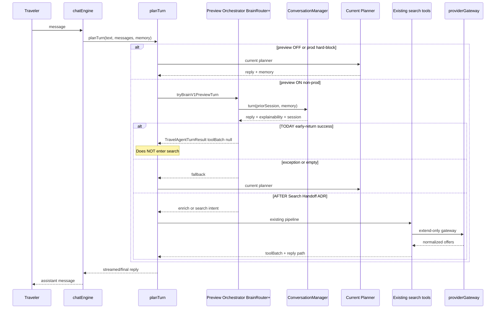
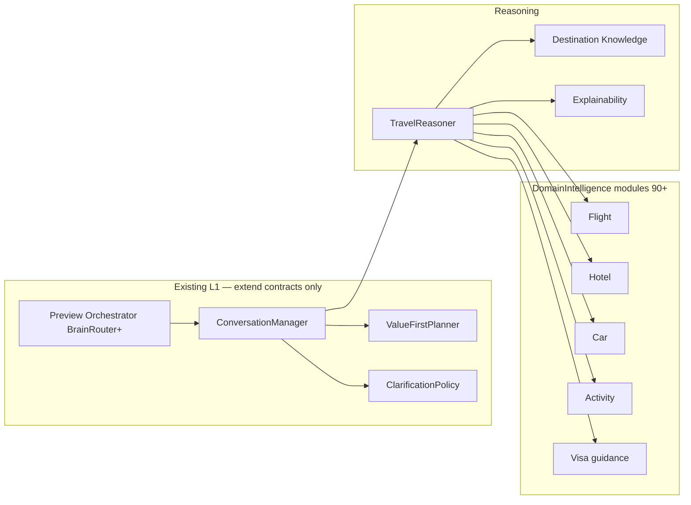
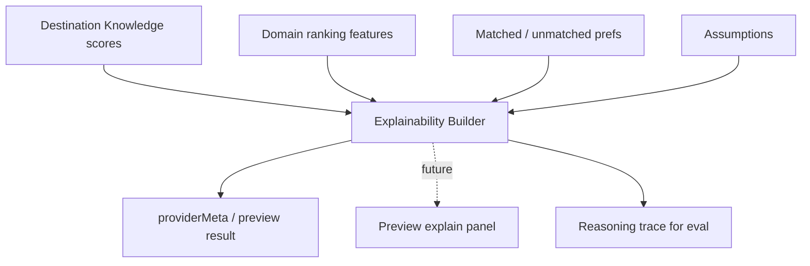
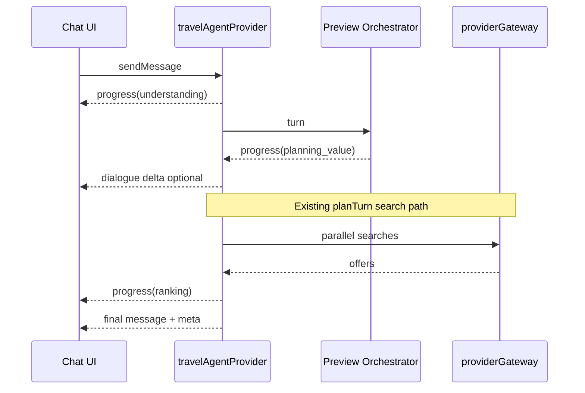
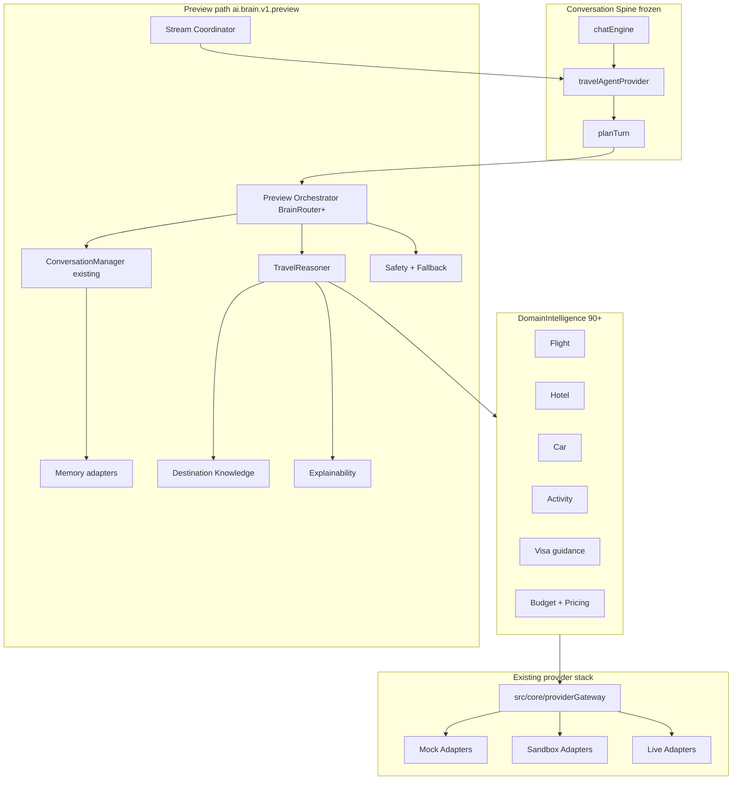
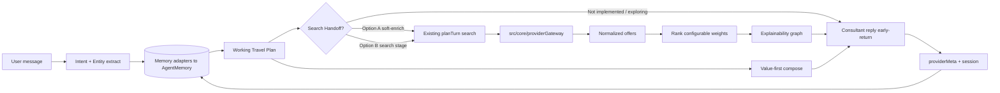

# Rahhal Travel Intelligence Engine  
## Architecture Design Document — Sprint 88–95

**Status:** Design revised — approved with required changes applied  
**Baseline:** Brain Foundation Complete (Sprint 81–87), tag `brain-foundation-complete-sprint-81-87`  
**Architecture review verdict:** APPROVE WITH REQUIRED CHANGES (resolved in this revision)  
**Main tip at design time:** `2acce1c` (merge #325); prior ADD revision baseline `fe560fb`  
**Non-goals:** No production code in this document · No feature-flag enablement · No Sprint 88 implementation until kickoff is explicitly authorized  

---

## 0. Executive summary

Sprint 81–87 delivered a gated **Brain Foundation** and a **Preview-only Live Brain Experience**:

- Sole turn owner remains `travelAgentService.planTurn`
- `ai.brain.v1` recovery-frozen **OFF**
- `ai.brain.v1.preview` default **OFF**, production hard-blocked
- Destination Knowledge + Explainable AI exist as structured islands
- ConversationManager already enforces value-first, question budget ≤ 1, and booking-stage blocking

Sprint 88–95 deepen **Travel Intelligence** **under** `planTurn` by evolving the existing preview path only:

- **Single migration path:** continue `ai.brain.v1.preview` — **do not introduce `ai.tie.v1`**
- **Preview Orchestrator (BrainRouter+)** extends BrainRouter contracts; does **not** rebuild ConversationManager / ValueFirstPlanner / ClarificationPolicy / L1–L2
- **Current preview early-returns** from `planTurn` with `toolBatch: null`; Search Handoff (ADR in Sprint 88, impl from Sprint 90) reconnects to the **existing** search pipeline and **`src/core/providerGateway`**
- **No parallel provider abstraction**

**Principle:** Extend intelligence under the Recovery turn owner; ship behind deploy-gated flags; always fall back to the Current Planner; production remains OFF without explicit approval.

---

## 1. Overall architecture

### 1.1 System context (as implemented today + planned handoff)

```text
┌─────────────────────────────────────────────────────────────────┐
│ Traveler (Arabic RTL SPA)                                       │
│  /chat · optional voice input · future explainability UI        │
└────────────────────────────┬────────────────────────────────────┘
                             │
┌────────────────────────────▼────────────────────────────────────┐
│ Conversation Spine (frozen owner)                               │
│  chatEngine → travel-agent provider → planTurn                  │
└────────────────────────────┬────────────────────────────────────┘
                             │
          ┌──────────────────┼──────────────────┐
          │ preview OFF /    │ preview ON       │
          │ prod hard-block  │ (non-prod only)  │
          ▼                  ▼                  │
   Current Planner    Preview Orchestrator      │
          │           (BrainRouter+)            │
          │                  │                  │
          │         ConversationManager (EXISTING)
          │         + Memory adapters           │
          │         + Reasoner / DK / XAI       │
          │                  │                  │
          │         ┌────────┴────────┐         │
          │         │ Early-return    │         │
          │         │ (TODAY)         │         │
          │         │ toolBatch=null  │         │
          │         └────────┬────────┘         │
          │                  │                  │
          │         Search Handoff (ADR 88;     │
          │         impl 90+) → existing tools  │
          │         + src/core/providerGateway  │
          └─────────┬─────────────────┬─────────┘
                    ▼                 ▼
              AgentMemory      Existing search pipeline
              TripPlan         + Provider Gateway (extend only)
```

### 1.2 Layered view

| Layer | Responsibility | Sprint focus | Notes |
| --- | --- | --- | --- |
| L0 Conversation spine | Turn ownership, streaming reply, UI contract | Frozen (Recovery) | Unchanged |
| L1 Orchestration | Intent, slots, question budget, value-first | **Shipped 85–87** | Sprint 88 = contract evolution only; **no rebuild** |
| L2 Memory | Session / preference / trip / long-term adapters | 88–89 | Deepen adapters; AgentMemory remains SoT |
| L3 Reasoning | Multi-step reasoner + domain selection | 89–90 | Extend TravelReasoner |
| L4 Domain intelligence | Flight, hotel, car, activity, visa guidance | 90–92 | Shared `DomainIntelligence` contract |
| L5 Commercial intelligence | Budget, indicative pricing | 92–93 | Never fabricate live fares |
| L6 Provider fabric | Extend existing gateway | 91–93 | **`src/core/providerGateway` only** |
| L7 Trust | Explainability, safety, eval, shadow | 88 skeleton → 94 | Golden evals + shadow from 88 |
| L8 Delivery | Streaming contracts, preview→beta rollout | 94–95 | Prod still OFF by default |

### 1.3 Non-negotiable constraints

1. **`RECOVERY_TURN_OWNER = travelAgentService.planTurn`** remains sole product turn owner.  
2. No parallel chat spine; no UI redesign required for L1–L7.  
3. **Single flag path:** `ai.brain.v1.preview` only for the soft pilot. **`ai.tie.v1` is forbidden.**  
4. `ai.brain.v1` stays recovery-frozen OFF (foundation island / stubs).  
5. Live providers remain mock-by-default; live gates stay OFF until explicit rollout.  
6. Never fabricate live prices/availability; estimates must be labeled indicative.  
7. Production enablement requires deploy-target hard-block + staged approval. Flags default OFF.  
8. Every preview path must degrade to Current Planner without user-visible errors or secret leakage.  
9. **Reuse** existing search pipeline and `src/core/providerGateway` — no parallel provider bus.  
10. Sprint 88 must **not** rebuild ConversationManager, ValueFirstPlanner, ClarificationPolicy, BrainRouter, or other shipped L1/L2 components.

---

## 2. Conversation orchestration

### 2.1 Preview Orchestrator (BrainRouter+)

Evolve Sprint 86–87 `BrainRouter` **contracts** (not a greenfield orchestrator) into **Preview Orchestrator (BrainRouter+)**:

1. Understands intent + trip style (existing extractors)  
2. Updates memory incrementally via **adapters** (AgentMemory remains source of truth)  
3. Decides value-first vs clarify (existing ClarificationPolicy; budget ≤ 1)  
4. Emits explainability + safety sidecars  
5. **Today:** early-returns a consultant reply without provider search  
6. **After Search Handoff:** may soft-enrich or hand off into the **existing** `planTurn` search / tool path (see §2.5)

**Do not rebuild:** ConversationManager, ValueFirstPlanner, ClarificationPolicy, ConfidenceEngine, BrainRouter core control flow.

### 2.2 Current preview flow (normative — as implemented)

When `ai.brain.v1.preview` is ON (and deploy gate allows non-prod):

1. `planTurn` calls `tryBrainV1PreviewTurn` (BrainRouter).  
2. On success, `planTurn` **returns immediately** with the Brain result.  
3. That result uses **`toolBatch: null`** — the Current Planner tool/search path is **not** entered for that turn.  
4. On exception or empty/null result, Brain fails **silently** and `planTurn` continues with the Current Planner.

This early-return is intentional for Sprint 86–87 conversation quality. Search reconnection is a **designed handoff**, not an accidental rewrite of `planTurn`.

### 2.3 Orchestration state machine (conceptual)

```text
Idle → Greeting
    → Exploring (value-first, assumptions)
    → Refining (incremental slot updates)
    → Searching (only after Search Handoff allows tools)
    → Comparing (multi-option explain)
    → ReadyForBooking (blocking fields only)
    → Paused / Recovered / Fallback
```

### 2.4 Conversation-first rules (normative)

Rahhal remains **conversation-first**, not form-first. These rules are already implemented in ConversationManager / ClarificationPolicy / AssumptionEngine and are **binding** for Sprint 88–95:

| Rule | Requirement |
| --- | --- |
| No form-first flow | Do not require a traditional multi-field form before value |
| Auto-extract | Extract known information from the user turn automatically |
| Safe assumptions | Use reversible assumptions where appropriate; never for visa, payment, or identity |
| Value before questions | Provide useful preliminary value before asking |
| Zero questions when enough | Ask **0** questions when confidence and slots suffice |
| At most one question | Default `DEFAULT_MAX_QUESTIONS_PER_TURN = 1` |
| Ask only when material | Ask only if the missing field blocks progress or materially changes the recommendation |
| Never re-ask known | Answered slots and sticky memory facts are not re-asked |
| Booking-only deferral | Defer passport, traveler identity, payment consent, and other booking-only details until booking/payment stages |
| Incremental revise | Change only affected fields; keep `planId` |

Confidence bands (existing ConfidenceEngine): high ≥ 0.75; medium ≥ 0.55; low_unsafe &lt; 0.5 → may `forceBlockingQuestion`.

### 2.5 Search Handoff architecture (decision required in Sprint 88 ADR)

**Problem:** Preview early-return never reaches provider search. ADD diagrams must not pretend search already runs under preview.

**Decision (Sprint 88 ADR — choose one; implement from Sprint 90):**

| Option | Behavior | When to prefer |
| --- | --- | --- |
| **A — Soft-enrich then continue** | Preview upgrades memory/session/XAI sidecar, then **does not early-return**; `planTurn` continues into the **existing** tool/search pipeline | Best reuse of Current Planner search; lower duplication |
| **B — Deferred search stage** | Keep early-return for Exploring/Refining; only when stage = Searching, Preview Orchestrator returns a structured **search intent** that `planTurn` executes via existing tools/gateway | Clear stage gating; slightly more contract surface |

**Normative constraints for either option:**

1. Reuse the **existing** search pipeline inside `planTurn` (tool execution / conversational search paths).  
2. Domain modules call **`src/core/providerGateway`** only — no new gateway.  
3. Partial provider success is allowed; user never sees raw provider errors or secrets.  
4. Until handoff is implemented, document and test the **early-return** behavior as current truth.  
5. Prevention: no infinite tool loops; dedupe identical tool calls per turn; never repeat the same clarification question.

### 2.6 Sequence — single user turn (preview ON, current vs post-handoff)



---

## 3. Memory system

### 3.1 Logical stores (not a second source of truth)

```text
┌──────────────────────────────────────────────┐
│ Memory adapters (Preview)                    │
│  maps to AgentMemory / existing engines      │
│  ┌─────────────┐  ┌──────────────────────┐   │
│  │ Working     │  │ Preference Memory    │   │
│  │ (slots,     │  │ (cabin, budget,      │   │
│  │  session,   │  │  airlines, hotel,    │   │
│  │  planId)    │  │  activities)         │   │
│  └─────────────┘  └──────────────────────┘   │
│  ┌─────────────┐  ┌──────────────────────┐   │
│  │ Trip Memory │  │ Long-term Profile    │   │
│  │ (itinerary, │  │ (opt-in persistent)  │   │
│  │  offers,    │  │                      │   │
│  │  decisions) │  │                      │   │
│  └─────────────┘  └──────────────────────┘   │
└──────────────────────────────────────────────┘
```

Also distinguished in product language:

- **Current turn context** — utterance, intent, entities for this turn  
- **Session memory** — preview session store in `providerMeta` / in-memory session  
- **Conversation memory** — multi-turn slot/provenance continuity  
- **Traveler preferences** — PreferenceEngine / Brain preference memory  
- **Trip-specific memory** — scoped to `planId` / trip; invalidated on new trip  
- **Long-term memory** — opt-in only; never silent PII persistence  

### 3.2 Mapping to existing code (reuse)

| Logical store | Existing foundation |
| --- | --- |
| Working / requirements | `AgentMemory` + provenance (`src/lib/agent/memory.ts`) — **source of truth** |
| Preference | `PreferenceEngine`, Brain `BrainV1PreferenceMemory`, ConversationMemoryAdapter |
| Trip | `TripPlan` / itinerary on AgentMemory |
| Long-term | Persistent preference profiles (flagged); Brain long-term interface (no product persistence yet) |
| Privacy helpers | `src/lib/brain/memory/privacy.ts` (redaction / sanitization) |

Sprint 88 deepens **adapters only**. Do not create a parallel Memory Fabric product store.

### 3.3 Design rules

- **Incremental writes only** — never wipe unrelated slots on refine.  
- **Provenance** — distinguish user-stated vs assumed vs provider-sourced; store confidence/source metadata.  
- **Correction / conflict** — user correction overrides assumptions; newer explicit user statement wins; provider facts never overwrite user-stated identity/payment fields.  
- **Assumptions reversible** until booking/payment confirmation.  
- **Trip isolation** — starting a new trip / new `planId` must not inherit stale offers, booking selections, or trip-specific assumptions from a prior trip. Preferences may carry only when provenance allows.  
- **Privacy** — long-term persistence opt-in; no silent PII exfiltration; mask passport/membership in logs (`privacy.ts`).

### 3.4 Persistence and privacy matrix

| Store | Persistence | Retention | Deletion | User isolation | Sprint |
| --- | --- | --- | --- | --- | --- |
| Turn context | Ephemeral | Turn lifetime | Automatic | Per turn | Exists |
| Preview session | `providerMeta` / in-memory | Conversation session | End session / clear meta | Per conversationId | 86–88 adapters |
| AgentMemory working | Client conversation state (+ optional Supabase persistence when grants allow) | Conversation / trip | User clear / new trip | Auth user / conversation RLS | Exists; 88 adapters |
| Preferences | PreferenceEngine (e.g. localStorage) + future opt-in profile | Until user clear | Explicit clear | Per browser profile / user id when persisted | 88–89 |
| Trip memory | Bound to `planId` | Until trip closed or superseded | New trip invalidates | Per user + planId | 88–89 |
| Long-term profile | Opt-in DB (future) | Policy TBD; max retention documented at impl | User delete + account delete | Strict user_id RLS | 89+ design; not Sprint 88 product |

**Database boundary:** Prefer existing Supabase tables / RLS patterns used by AgentMemory persistence. No new cross-user readable stores. Preview must not write secrets or provider credentials into memory.

---

## 4. Reasoning engine

### 4.1 Role

The Travel Reasoner is the **central multi-step intellect** (extend existing module; do not fork):

1. Interprets goal + constraints  
2. Selects which domain intelligences to invoke (post–Search Handoff)  
3. Applies Destination Knowledge + traveler style  
4. Ranks options with explainable, **configurable** scores  
5. Produces consultant-facing narrative inputs (not raw dumps)

### 4.2 Product path vs stub agents

| Path | Status | Role in 88–95 |
| --- | --- | --- |
| **Product path** | ConversationManager + ValueFirstPlanner + ClarificationPolicy + TravelReasoner + DK + XAI under `ai.brain.v1.preview` | **Sole product preview path** |
| **Stub agent graph** | AgentOrchestrator + agent definitions under recovery-frozen `ai.brain.v1` | Optional specialist fan-out later; **not product-wired in Sprint 88**; do not duplicate CM responsibilities |

Existing stub agents (planner, memory, travel, flight, hotel, package, weather, maps, visa, pricing, booking, safety, response) remain stubs. There are **no** separate Destination / Car / Activities / Payment agent products today. Destination Knowledge is a **data module**, not a Destination Agent.

### 4.3 Reasoning trace (extended)

```text
understand_request
 → resolve_conversation_context
 → load_memory
 → destination_reasoning
 → trip_style_reasoning
 → detect_missing_information
 → choose_tools / domain_intelligences   (only after Search Handoff)
 → collect_provider_results              (via existing gateway)
 → evaluate_results
 → rank_offers                           (configurable weights)
 → optimize_budget (optional)
 → explain_recommendation
 → generate_natural_answer
 → generate_booking_actions (gated; never accidental)
```

### 4.4 Component diagram — reasoning core



### 4.5 Deterministic safeguards

- Confidence thresholds drive clarify vs continue (existing engine).  
- Assumption tracking with reversible flags.  
- Retry/recovery: provider/domain failures → partial results or skip domain; orchestrator throw → Current Planner.  
- Prevent infinite loops, duplicated tool calls, and repeated questions (askedFields / question budget).  
- No silent failures that look like success with empty fabricated inventory.

---

## 5. Shared DomainIntelligence contract

All domain modules (Flight, Hotel, Car, Activity, Visa guidance, Package, Budget/Pricing) implement the same contract. **Interfaces only in Sprint 88**; implementations from Sprint 90+.

### 5.1 Interface (design)

```text
DomainIntelligence<TQuery, TOffer> {
  id: 'flight' | 'hotel' | 'car' | 'activity' | 'visa' | 'package' | 'budget' | 'pricing'
  buildQuery(plan, memory, prefs) -> TQuery | skip
  execute(query, gateway: ProviderGateway) -> DomainResult<TOffer>   // gateway = src/core/providerGateway
  rank(offers, prefs, weights) -> RankedOffer[]
  explain(ranked) -> ExplainabilityNode
  timeouts: { softMs, hardMs }
  retry: { max, backoff }   // idempotent reads only
  fallback: 'skip_domain' | 'indicative_only' | 'clarify_once'
  telemetry: { domain, latency, partial, errorClass }  // never secrets
}
```

### 5.2 Structured response contract

| Field | Requirement |
| --- | --- |
| `ok` / `partial` / `skipped` | Explicit status |
| `offers` | Normalized offers only (see §12.4) |
| `explainability` | Required for any recommendation presented as ranked |
| `assumptions` | Listed; reversible |
| `errors` | Sanitized error class; no provider raw payloads to UI |
| `provenance` | Provider ids + fetch timestamps |

### 5.3 Ownership rules

- Clear ownership per domain; no overlapping book/pay responsibilities.  
- Booking Agent / Payment remain **out of product path** for 88–95 (stubs or future).  
- Error isolation: one domain failure must not fail the whole turn.  
- Telemetry on every invoke; timeout → partial or skip.

---

## 6. Flight intelligence

### 6.1 Responsibilities

- Parse origin/destination/dates/cabin/airline prefs  
- Build search intents for **existing** Provider Gateway  
- Normalize offers across providers  
- Rank by configurable weights (price, duration, stops, airline quality, prefs, …)  
- Explain top pick vs alternatives  
- Respect soft constraints (time of day, max stops)

### 6.2 Reuse

- Mock + live flight adapters (`conversationalProvider`, `liveFlightSearch`, Amadeus pilot)  
- Ranking/explain modules under `integrationFlightSearch`  
- Cabin / airline fields already in slots + AgentMemory  
- **`src/core/providerGateway`** for resolve/health/metrics/errors  

### 6.3 Sprint placement

- **Sprint 88:** interface only (DomainIntelligence)  
- **Sprint 90:** Flight Intelligence mock-first  
- **Sprint 91:** Multi-provider merge + failover via existing gateway extensions  
- **Sprint 93–94:** Indicative pricing signals + stronger explainability  

---

## 7. Hotel intelligence

### 7.1 Responsibilities

- Location / dates / rooms / star / amenities  
- Family vs business vs honeymoon fit scores  
- Neighborhood suitability from Destination Knowledge  
- Rank + explain; never invent availability  

### 7.2 Reuse

- Hotel mock/live adapters, `integrationHotelSearch` ranking explain  
- `hotelPreference`, amenities, breakfast/cancellation soft prefs  
- Same Provider Gateway  

### 7.3 Sprint placement

- **Sprint 90–91:** Hotel Intelligence parallel to flights  
- **Sprint 92–93:** Package alignment with flight+hotel  

---

## 8. Car rental intelligence

### 8.1 Responsibilities (new domain module)

- Infer need from destination, duration, party size, trip style  
- Propose car class bands (economy / SUV / …) as **indicative**  
- Airport pickup/drop hints from Destination Knowledge airports  
- Optional provider adapter via **existing** gateway (mock-first)

### 8.2 Design note

No production car booking in 88–95 unless a mock adapter lands; focus on **need detection + recommendation framing** first (Sprint 92).

---

## 9. Activity intelligence

### 9.1 Responsibilities

- Map interests/activities to day-level suggestions  
- Use Destination Knowledge attractions + city scores  
- Respect pace (family / weekend / leisure)  
- Feed itinerary skeleton without claiming ticket inventory  

### 9.2 Sprint placement

- **Sprint 91–92:** Activity Intelligence composing itinerary sketches  
- Integrates with existing itinerary / trip builder enrichments  

---

## 10. Visa intelligence (guidance now; product visa later)

### 10.1 Near-term responsibilities (Sprint 92)

- Provide **guidance**, never legal conclusions  
- Inputs: nationality (if known), destination, trip purpose  
- Outputs: “may need / check official source”, document checklist hints  
- **Never assume visa** in AssumptionEngine (already forbidden)  
- Clarify nationality only when required at booking stage  

### 10.2 Roadmap only — post-core appendix

Visa **product** features are **out of Sprint 88–95 implementation** beyond guidance:

1. **First (post-core):** Saudi tourism **package visa** support — document management, eligibility, status tracking, issuance notifications, accredited provider integration.  
2. **Later:** Schengen, UK, Canada, United States visas.  

Keep all visa product work **after** the core travel platform (search, rank, explain, booking readiness) is stable. See **Appendix A**.

---

## 11. Budget optimization

### 11.1 Responsibilities

- Allocate indicative budget across flight / hotel / local / buffer  
- Detect overspend risk vs stated ceiling  
- Suggest tradeoffs (dates flexible, cabin down, hotel tier)  
- Emit Budget Score for ranking inputs  

### 11.2 Reuse

- `budgetIntelligence`, integration budget pricing (flagged), trip optimizer Journey Score  
- Unify naming in ranking config (glossary); avoid three competing hard-coded scorers long-term  

### 11.3 Sprint placement

- **Sprint 92–93:** Unify budget signals into preview ranking inputs  

---

## 12. Dynamic pricing and prediction

### 12.1 Scope (careful)

- **Prediction = indicative trend signals**, not guarantees  
- Inputs: historical mock/sandbox series, seasonality from Destination Knowledge, lead time  
- Outputs: “prices often higher in peak season”, confidence band, assumptions  
- Hard rule: never present prediction as a live fare  

### 12.2 Sprint placement

- **Sprint 93:** Pricing intelligence interface + mock predictors  
- **Sprint 94:** Wire explanations into XAI payload  

---

## 13. Multi-provider orchestration

### 13.1 Extend existing Provider Gateway only

```text
Domain Intelligence
  → src/core/providerGateway (EXISTING — extend, do not replace)
       → ProviderRegistry / Resolver (mock | sandbox | live*)
       → Adapters (Amadeus, Duffel, Booking.com, …)
       → ProviderResponseMapper → Normalize → Merge → Dedupe
       → ProviderHealthMonitor + ProviderMetrics
       → Failover (live → sandbox/mock)
```

\*Live only when flag + deploy profile allow.

**Forbidden:** a parallel “TIE provider bus”, duplicate registry, or second health stack.

### 13.2 Policies

| Policy | Rule |
| --- | --- |
| Default | Mock adapters (CI / no keys) |
| Failover | Live error → sandbox/mock without user error dump |
| Merge | Normalize currency/time; keep provider provenance |
| Timeout | Per-provider budgets; partial results OK |
| Rate limits | Respect adapter limits; shed load via skip/partial |
| Caching | TTL cache with stale-result detection |
| Pilot gates | Same non-prod hard-block pattern as `ai.brain.v1.preview` |
| Comparison | Rank across providers; never depend only on Amadeus or Booking.com |

### 13.3 Offer normalization checklist

Every offer entering ranking must normalize:

| Dimension | Requirement |
| --- | --- |
| Currency | Convert/label to traveler currency; keep original |
| Taxes and fees | Separate base vs taxes/fees when provider supplies; else mark unknown |
| Baggage | Structured included/paid/unknown |
| Fare family | Cabin + branded fare attributes when available |
| Cancellation / refund | Refundable / partial / non-refundable / unknown |
| Schedule | Total travel time, stops, layover quality |
| Deduplication | Same itinerary across providers → single compare group with multi-provider prices |
| Freshness | `fetchedAt` + stale threshold; **price refresh before booking** |
| Provenance | Provider id, request id, confidence |

### 13.4 Sprint placement

- **Sprint 88:** document reuse + interface touchpoints only  
- **Sprint 91:** standardize merge/failover/partial success on **existing** gateway  
- **Sprint 93:** packages / optional car mock via same gateway  

---

## 14. Ranking and recommendation quality

### 14.1 Ranking factors (configurable)

Weights must be **configurable** (see Brain `RecommendationEngine` `RankingWeights` pattern). **Do not** hard-code weights around Morocco or a small destination set.

Factors to support over time:

- Price / value-for-money  
- Total travel time, stops, schedule convenience  
- Baggage, refundability  
- Hotel location, rating  
- Traveler preferences, trip purpose, family suitability, accessibility  
- Reliability / provider confidence  
- Explainable alternatives (next-best always available when ≥2 offers)

Destination Knowledge city ranking remains **data-driven** (scores + style weights in data/config), not destination-specific essays.

### 14.2 Ranking / XAI unification

| Concern | Direction |
| --- | --- |
| Multiple scorers today | Brain RecommendationEngine, flight/hotel integration rankers, bookingIntelligence, Journey Score |
| Unification | Single ranking config surface feeding Explainability nodes; domain rankers adapt to shared weight keys |
| Geo hardcoding | Forbidden for product recommendations; DK entries are data, not special-case code paths |
| Sprint 88 | Document config keys + interface; no scorer rewrite required |
| Sprint 90–94 | Migrate domain rank outputs into Trip Explainability Graph |

---

## 15. Destination knowledge

### 15.1 Principles

- Data-driven extensibility via registry + versioned data files  
- Avoid destination-specific essays and hard-coded recommendation branches  
- Cities, countries, seasons, budget bands, trip style, climate, visa **hints**, airports, transport, safety, cultural considerations as structured fields  

### 15.2 Static vs live

| Kind | Source |
| --- | --- |
| Static / versioned | Destination Knowledge registry (climate bands, style scores, attraction tags, airport codes) |
| Live tools | Prices, availability, weather nowcasts, maps ETA, visa **status** product APIs (future) |

### 15.3 Freshness / versioning

- Each knowledge pack declares `schemaVersion`, `contentVersion`, `updatedAt`  
- CI validates schema; stale packs flagged in telemetry  
- Expansion = add data files + tests; no new code path per country  

### 15.4 Authoritative sources (later)

Official tourism boards, government visa sites, airport/IATA references, accredited weather/maps providers — cited in guidance, never as fabricated inventory.

---

## 16. Explainability

### 16.1 Unify Explainable AI

Extend Sprint 87 `ExplainableRecommendation` to a **Trip Explainability Graph**:

| Node | Fields |
| --- | --- |
| Destination / city | confidence, rankingScore, explanations, matched/unmatched prefs, assumptions, alternatives |
| Flight option | why chosen vs next best |
| Hotel option | fit scores + amenity matches |
| Package | tradeoff summary |
| Clarification | why this one question |

### 16.2 Presentation

- Sprint 88–94: structured sidecar (`destinationExplainability` pattern)  
- Sprint 95: optional preview UI surfacing (still no mandatory UI redesign)  

### 16.3 Data flow — explainability



---

## 17. Booking and payment boundaries

### 17.1 Stages (strict separation)

```text
Discovery → Recommendation → Selection → Confirmation → Booking → Payment
```

| Stage | Allowed | Forbidden |
| --- | --- | --- |
| Discovery / Recommendation | Search, rank, explain, indicative prices | Charge cards, create PNR as confirmed |
| Selection | User picks option | Auto-book |
| Confirmation | Explicit user confirm language | Implicit “looks good” as book |
| Booking | Price/availability **refresh**, idempotent book attempt | Silent retry that double-books |
| Payment | Future gateway (Tap, Tamara, …) | Implementing payments in 88–95 |

### 17.2 Rules

- Prevent accidental booking; require explicit user confirmation.  
- Refresh price and availability immediately before booking.  
- Idempotency keys on booking attempts; handle failed/partial bookings with user-visible recovery (no silent success).  
- Preserve audit trail (who/when/what offer/provider).  
- Rahhal may collect payment later; **do not implement** payment now.  
- Support future gateway abstraction including Tap and Tamara (ports only; out of 88–95).

---

## 18. AI safety and fallback strategy

### 18.1 Safety layers

1. **Deploy gate** — production hard-blocks `ai.brain.v1.preview`  
2. **Feature flags** — `ai.brain.v1` frozen OFF; preview default OFF  
3. **Input safety** — no sensitive assumptions (visa/payment/identity)  
4. **Output safety** — no fabricated live inventory; indicative labeling  
5. **Execution safety** — tool cancellation, dependency checks (Sprint 85 engine)  
6. **Fallback** — any throw/empty → Current Planner (Sprint 86 pattern)  
7. **Shadow mode** — compare preview vs Current Planner offline/metrics without user-facing preview (Sprint 88+ telemetry)  
8. **Eval harness** — golden conversations (skeleton Sprint 88; domain coverage through 94)  
9. **No secret leakage** — never expose provider errors, keys, or raw payloads to UI  

### 18.2 Fallback matrix

| Failure | Behavior |
| --- | --- |
| `ai.brain.v1.preview` OFF | Current Planner |
| Production deploy | Current Planner (hard block) |
| Orchestrator exception | Silent fallback to Current Planner |
| Provider timeout | Partial domain results or skip domain |
| Low confidence | Value-first + at most one clarify |
| Booking stage missing legal fields | Blocking question only |
| Search Handoff not yet implemented | Early-return consultant path (current behavior) |

### 18.3 Shadow mode and quality thresholds

| Metric | Target (beta) |
| --- | --- |
| Fallback rate | &lt; 2% of preview turns |
| Question budget violations | 0 |
| Fabricated live price incidents | 0 |
| Shadow disagreement rate | Tracked; investigate spikes |
| p95 time-to-first-value | Budgeted per stream phase |
| Explainability present on recommendations | 100% of preview domain recs |

Automatic fallback to Current Planner on failure; **no silent failures** that present empty or fabricated success.

---

## 19. Streaming and Voice compatibility

### 19.1 Streaming goals

- Keep perceived latency low on long reasoning + multi-provider searches  
- Preserve existing travel-agent provider streaming contracts  
- Stream coordination owned by the **conversation spine**, not by a voice vendor SDK  

### 19.2 Proposed stream events (design)

```text
phase: understanding
phase: planning_value        (value-first draft tokens)
phase: searching_flights     (progress)
phase: searching_hotels
phase: ranking
phase: explaining
phase: final                 (complete reply + meta)
```

### 19.3 Streaming rules

- Never stream unsafe/partial booking confirmations  
- Final event remains source of truth for persisted assistant message  
- Partial response generation allowed for value-first text only  
- Preview-only until Sprint 95 rollout criteria met  

### 19.4 Voice compatibility (no current Voice implementation changes)

| Requirement | Design |
| --- | --- |
| STT / TTS | Future-compatible; Brain/Preview must not couple to a single voice provider |
| Interruption / resume | Spine-level; Preview Orchestrator must accept cancel/partial turn signals later |
| Arabic-first | Existing locale/`ar` consultant behavior remains default |
| Current work | **No Voice, STT, or TTS code changes** in Sprint 88–95 unless separately approved |

### 19.5 Sequence — streamed search turn (post–Search Handoff)



---

## 20. Production rollout strategy

### 20.1 Flag ladder (single path — normative)

| Flag | Default | Environments | Purpose |
| --- | --- | --- | --- |
| `ai.brain.v1` | OFF **recovery-frozen** | none | Foundation island / stubs |
| `ai.brain.v1.preview` | OFF | dev → staging → beta only | **Sole** soft pilot under `planTurn` |
| Domain live flags | OFF | gated | Real providers |

**`ai.tie.v1` is not used and must not be added.**

### 20.2 Stages

1. **Dev** — mock providers, golden evals, shadow telemetry  
2. **Preview/Staging** — `ai.brain.v1.preview` ON for non-prod only; optional sandbox providers  
3. **Controlled beta** — limited cohort; SLOs on fallback / fabrication / question budget  
4. **Production** — only after explicit approval; deploy hard-block remains until then; flags still default OFF  

### 20.3 Kill switches

- Disable `ai.brain.v1.preview` → immediate Current Planner  
- Provider-level disable → mock failover via existing gateway  
- Never remove Recovery freeze without an explicit later program  

### 20.4 Rollout rules

- Preview-only until criteria met  
- Shadow mode before broad beta  
- No production enablement without explicit approval  
- No exposure of provider errors or secrets  
- Controlled beta before any production discussion  

---

## 21. Component diagram (Preview Intelligence under planTurn)



---

## 22. Data flow diagram



---

## 23. Roadmap by Sprint (88–95) — corrected

### Sprint 88 — Preview contracts, memory adapters, handoff ADR, evals (minimal)

**In scope only:**

- Preview Orchestrator **contract evolution** on BrainRouter+ (no L1/L2 rebuild)  
- Memory **adapters** (working + preference + trip) with provenance; AgentMemory remains SoT  
- **Search Handoff ADR** (Option A vs B) — design decision + tests of current early-return  
- **Golden evaluation** framework skeleton  
- **Shadow telemetry** (preview vs Current Planner metrics; default OFF, no user-facing enable)  
- **Required interfaces only** (`DomainIntelligence` sketch, ranking config keys, offer normalization checklist as types/docs)

**Explicitly out of Sprint 88:**

- Rebuilding ConversationManager, ValueFirstPlanner, ClarificationPolicy, BrainRouter, or Memory Fabric product  
- New flag `ai.tie.v1`  
- Domain search implementation  
- New provider abstraction  
- UI / Voice / booking / payments / production enable  

**Deliverable:** ADR + adapter/interface scaffolding + eval/shadow harness skeleton; flags remain OFF.

### Sprint 89 — Reasoning Engine vNext

- Expand TravelReasoner domain selection  
- Confidence bands drive clarify vs continue (tests)  
- Destination Knowledge expansion process (data only)  
- Structured reasoning traces for eval  

### Sprint 90 — Flight & Hotel Intelligence + Search Handoff implementation

- Implement chosen Search Handoff into **existing** search pipeline  
- Domain modules with mock-first search intents via **existing** gateway  
- Rank + explain into XAI graph  
- No production live enable  

### Sprint 91 — Gateway standardization + Activities + stream progress

- Extend `src/core/providerGateway` merge/failover/partial success  
- Activity Intelligence → itinerary sketch enrichment  
- Parallel search streaming progress events (preview; spine-owned)  

### Sprint 92 — Car, Visa guidance, Budget optimization

- Car need detection + indicative classes  
- Visa **guidance** module (non-assumptive); no package-visa product  
- Unified budget allocation into ranking inputs  

### Sprint 93 — Dynamic Pricing Signals + Package Intelligence

- Indicative pricing/prediction interfaces  
- Flight+hotel package compare with tradeoff explanations  
- Safety evals against fabrication  

### Sprint 94 — Trust, Eval, Streaming Hardening

- End-to-end explainability completeness  
- Fallback/chaos tests  
- Stream event contract freeze  
- Beta readiness checklist  

### Sprint 95 — Preview beta & production strategy (flags still default OFF)

- Controlled beta enable of **`ai.brain.v1.preview`** on staging/beta only  
- Optional preview UI for explainability (minimal, additive)  
- Production rollout plan sign-off  
- **Still no silent production enable**; production remains hard-blocked until explicit approval  

---

## 24. Dependency map (Sprint 88–95)

```text
[Frozen] planTurn + Current Planner + Recovery flags
        │
        ▼
88  Evolve ai.brain.v1.preview contracts (BrainRouter+)
    Memory adapters + provenance
    Search Handoff ADR (document early-return)
    Golden evals + shadow telemetry
    DomainIntelligence + ranking/XAI interfaces only
        │
        ▼
89  Reasoner vNext + traces + DK data process
        │
        ├──────────────────┐
        ▼                  ▼
90  Search Handoff impl    Flight + Hotel DomainIntelligence
    into existing tools    mock-first + XAI nodes
        │
        ▼
91  Extend src/core/providerGateway
    Activity sketches + stream progress
        │
        ▼
92  Car framing + Visa guidance + Budget unify
        │
        ▼
93  Indicative pricing + Package compare
        │
        ▼
94  Trust / chaos / stream freeze / beta checklist
        │
        ▼
95  Staging/beta via ai.brain.v1.preview only
    Prod still OFF without explicit approval
```

---

## 25. Module ownership (summary)

| Module | Responsibility | Input | Output | Dependencies | Fallback | Sprint |
| --- | --- | --- | --- | --- | --- | --- |
| `planTurn` | Sole turn owner | text, messages, memory | Turn result | chatEngine, flags | N/A | Frozen |
| Current Planner | Stable path | same | reply + tools | search pipeline | N/A | Frozen |
| Preview Orchestrator (BrainRouter+) | Soft pilot entry / contracts | turn + session | result or null | CM (existing) | Current Planner | 86–87; evolve 88 |
| ConversationManager | Value-first + ≤1 Q | session, memory | reply, slots, XAI | VF, Clarification, Reasoner, DK | router fallback | Shipped; **do not rebuild** |
| Memory adapters | Map logical stores → AgentMemory | memory, session | updated memory | AgentMemory, privacy | prior memory | 88–89 |
| TravelReasoner | Multi-step reasoning | entities, prefs, DK | domain selection + narrative | DK, XAI | value-only | 89 |
| DomainIntelligence | Shared domain I/O | plan, gateway | ranked + XAI | providerGateway | skip domain | Interface 88; impl 90+ |
| `src/core/providerGateway` | Resolve/normalize/health | domain queries | offers | adapters | mock/partial | Extend 91 |
| Search Handoff | Preview ↔ existing search | stage, intent | continue or early-return | planTurn tools | early-return | ADR 88; impl 90 |
| Explainability | Why / alternatives | scores, prefs | graph/sidecar | Reasoner, rankers | omit | 87; unify 90–94 |
| Golden eval + shadow | Quality gates | fixtures | metrics | preview OFF by default | N/A | 88 skeleton → 94 |
| Booking / Payment | Confirm, refresh, pay | selection | future | gateways | disabled | Post 95 / out of scope |
| Visa product | Package visa etc. | docs, eligibility | status | accredited providers | guidance only | Appendix A post-core |

---

## 26. Dependency on Sprint 81–87 foundation

| Foundation | Used by Sprint 88–95 |
| --- | --- |
| ConversationManager + Value Before Questions | Orchestration core (**reuse, do not rebuild**) |
| ClarificationPolicy / ConfidenceEngine / AssumptionEngine | Conversation-first rules |
| Destination Knowledge + scores | Destination / activity / style reasoning |
| Explainable AI payload | Trip Explainability Graph |
| BrainRouter fallback | Safety backbone → Preview Orchestrator (BrainRouter+) |
| Tool Execution Engine | Controlled provider calls after Search Handoff |
| Travel Planning Engine | Incremental slots / planId |
| Agent Orchestrator stubs | Optional fan-out only; frozen `ai.brain.v1` |
| `src/core/providerGateway` | Sole provider fabric to extend |
| Recovery freeze | Production safety |

---

## 27. Explicitly out of scope for 88–95 (unless later approved)

- Replacing `planTurn` as turn owner  
- Introducing `ai.tie.v1` or any second preview flag  
- Rebuilding shipped L1/L2 conversation components  
- Creating a parallel provider abstraction  
- Payments live enable / Tap / Tamara implementation  
- Saudi package visa product (appendix only)  
- Schengen / UK / Canada / USA visa products  
- Full duplex realtime voice redesign / STT-TTS provider coupling  
- Guaranteed fare prediction marketed as live price  
- Unflagged or silent production preview enable  

---

## 28. Approval checkpoint

**This document is design-only.** Architecture review required changes are applied here.

**Accepted principles:**

1. Intelligence layers under `planTurn`  
2. **Single flag path:** `ai.brain.v1.preview` only (no `ai.tie.v1`)  
3. Preview Orchestrator (BrainRouter+); preserve early-return until Search Handoff  
4. Extend `src/core/providerGateway` only  
5. Minimal Sprint 88 (contracts, adapters, ADR, evals, shadow, interfaces)  
6. Domain order: Flight/Hotel + handoff → Gateway/Activities → Car/Visa guidance/Budget → Pricing → Trust → Beta  
7. Production remains OFF without explicit approval  

**Flags remain:** `ai.brain.v1 = OFF`, `ai.brain.v1.preview = OFF`.

---

## Appendix A — Visa product roadmap (post-core)

> Not part of Sprint 88–95 delivery. Guidance-only Visa Intelligence may land in Sprint 92.

1. **Stabilize core platform** — search, rank, explain, booking readiness, payments strategy.  
2. **Saudi tourism package visa (first product visa)** — document management, eligibility, status tracking, issuance notifications, accredited provider integration.  
3. **Later corridors** — Schengen, United Kingdom, Canada, United States.  
4. Constraints — never legal advice; never assume visa eligibility; official sources win; user confirmation for submissions.

---

## Appendix B — Conditions Required Before Sprint 88 Can Start

- [x] ADD revised: no `ai.tie.v1`; single path `ai.brain.v1.preview`  
- [x] Early-return documented; Search Handoff ADR required in Sprint 88  
- [x] Existing search pipeline + `src/core/providerGateway` mandated  
- [x] Sprint 88 scope minimized (no L1/L2 rebuild)  
- [x] Conversation-first rules normative  
- [x] Memory persistence/privacy matrix added  
- [x] DomainIntelligence + offer normalization + ranking/XAI config specified  
- [x] Voice provider-agnostic compatibility stated; no Voice impl now  
- [x] Rollout/shadow/SLOs documented; production OFF  
- [x] Visa product deferred to Appendix A  
- [x] Both Brain flags remain OFF  

**Sprint 88 implementation may begin only after explicit kickoff authorization** (this ADD revision satisfies the architecture-review gate).

---

*Brain Foundation Complete (Sprint 81–87) · Tag `brain-foundation-complete-sprint-81-87` · Architecture ADD revised per review · Flags OFF · No Sprint 88 implementation in this change.*
