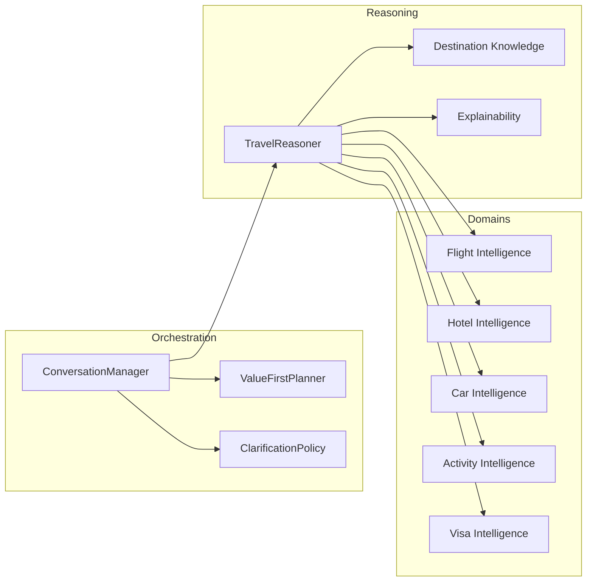
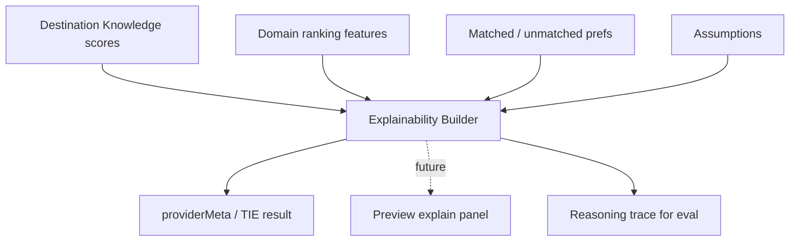
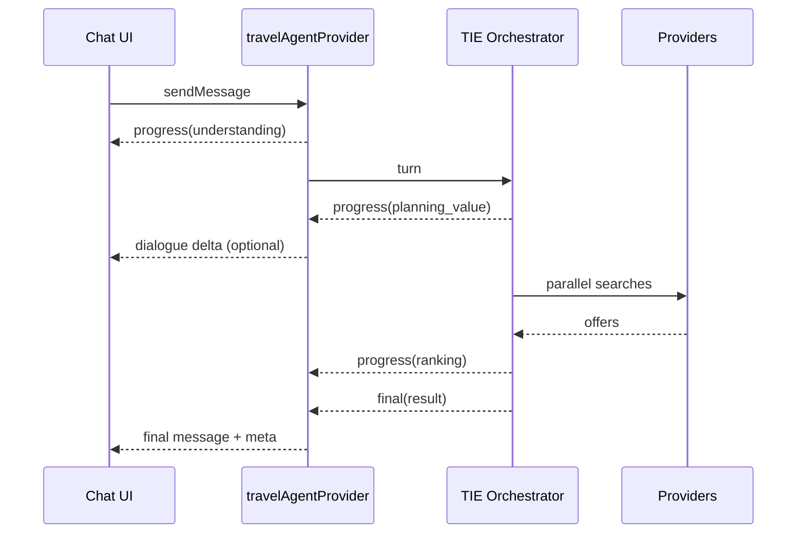
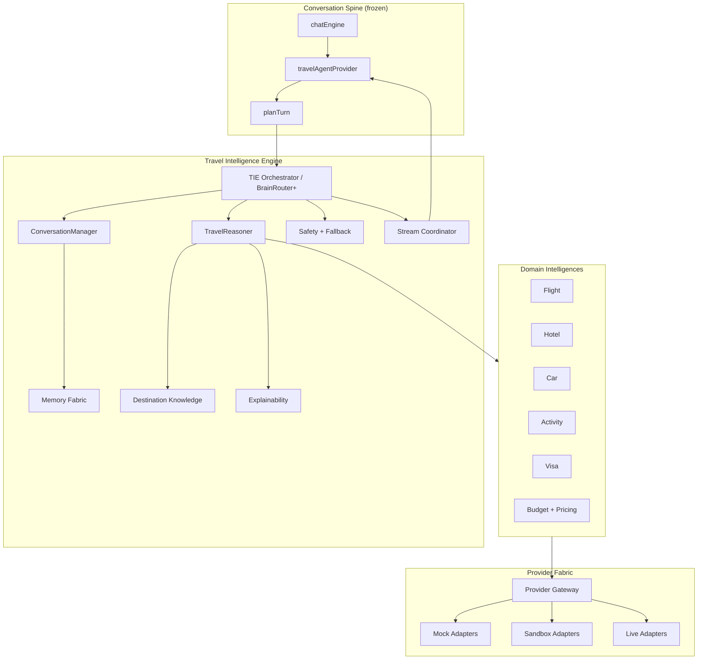
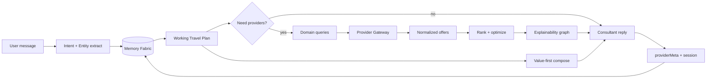

# Rahhal Travel Intelligence Engine  
## Architecture Design Document — Sprint 88–95

**Status:** Design only — awaiting approval  
**Baseline:** Brain Foundation Complete (Sprint 81–87), tag `brain-foundation-complete-sprint-81-87`  
**Main tip at design time:** `2acce1c` (merge #325)  
**Non-goals:** No implementation in this document · No production code · No PR · No Sprint 88 start until approved  

---

## 0. Executive summary

Sprint 81–87 delivered a gated **Brain Foundation** and a **Preview-only Live Brain Experience**:

- Sole turn owner remains `travelAgentService.planTurn`
- `ai.brain.v1` recovery-frozen **OFF**
- `ai.brain.v1.preview` default **OFF**, production hard-blocked
- Destination Knowledge + Explainable AI exist as structured islands

Sprint 88–95 design the **Travel Intelligence Engine (TIE)**: a multi-domain reasoning + multi-provider orchestration layer that deepens planning quality **under** `planTurn`, without introducing a second conversation owner.

**Principle:** Extend intelligence under the Recovery turn owner; ship behind deploy-gated flags; always fall back to the current planner.

---

## 1. Overall architecture

### 1.1 System context

```text
┌─────────────────────────────────────────────────────────────────┐
│ Traveler (Arabic RTL SPA)                                       │
│  /chat · optional voice input · future explainability UI        │
└────────────────────────────┬────────────────────────────────────┘
                             │
┌────────────────────────────▼────────────────────────────────────┐
│ Conversation Spine (frozen owner)                               │
│  chatEngine → travel-agent provider → planTurn                  │
└────────────────────────────┬────────────────────────────────────┘
                             │
          ┌──────────────────┼──────────────────┐
          │ preview OFF      │ preview / TIE ON │
          ▼                  ▼                  │
   Current Planner    BrainRouter / TIE Orchestrator
          │                  │                  │
          │         ┌────────┴────────┐         │
          │         ▼                 ▼         │
          │  Conversation Mgr   Domain Intelligences
          │  + Memory           (flight/hotel/car/…)
          │  + Reasoner         + Multi-provider bus
          │  + Explainability   + Budget / pricing
          └─────────┬─────────────────┬─────────┘
                    │                 │
                    ▼                 ▼
              AgentMemory      Provider Gateway
              TripPlan         (mock → sandbox → live)
```

### 1.2 Layered view

| Layer | Responsibility | Sprint focus |
| --- | --- | --- |
| L0 Conversation spine | Turn ownership, streaming reply, UI contract | Frozen (Recovery) |
| L1 Orchestration | Intent, slots, question budget, value-first | 88 |
| L2 Memory | Session / preference / long-term / trip state | 88–89 |
| L3 Reasoning | Multi-step travel reasoner + domain planners | 89–90 |
| L4 Domain intelligence | Flight, hotel, car, activity, visa | 90–92 |
| L5 Commercial intelligence | Budget, dynamic pricing, prediction | 92–93 |
| L6 Provider fabric | Multi-provider resolve, failover, merge | 91–93 |
| L7 Trust | Explainability, safety, fallback, eval | 93–94 |
| L8 Delivery | Streaming UX contracts, preview→prod rollout | 94–95 |

### 1.3 Non-negotiable constraints

1. **`RECOVERY_TURN_OWNER = travelAgentService.planTurn`** remains sole product turn owner.  
2. No parallel chat spine; no UI redesign required for L1–L7.  
3. Live providers remain mock-by-default; live gates stay OFF until explicit rollout.  
4. Never fabricate live prices/availability; estimates must be labeled indicative.  
5. Production enablement requires deploy-target gates + staged flags (mirror Brain preview).  
6. Every TIE path must degrade to Current Planner without user-visible errors.

---

## 2. Conversation orchestration

### 2.1 Target orchestrator

Evolve Sprint 86–87 `BrainRouter` + `ConversationManager` into a **TIE Orchestrator** that:

1. Understands intent + trip style  
2. Updates memory incrementally  
3. Decides value-first vs clarify (question budget ≤ 1 by default)  
4. Selects domain intelligences (flight / hotel / …)  
5. Merges results into a coherent consultant reply + structured plan  
6. Emits explainability + safety notes  

### 2.2 Orchestration state machine (conceptual)

```text
Idle → Greeting
    → Exploring (value-first, assumptions)
    → Refining (incremental slot updates)
    → Searching (provider calls allowed)
    → Comparing (multi-option explain)
    → ReadyForBooking (blocking fields only)
    → Paused / Recovered / Fallback
```

### 2.3 Policies carried forward

| Policy | Rule |
| --- | --- |
| Value Before Questions | Deliver useful preliminary value before asking |
| Question budget | Default 1; 0 when enough is known |
| Never re-ask known | Answered slots / memory facts are sticky |
| Incremental revise | Change only affected fields; keep `planId` |
| Booking/payment | Blocking questions only at those stages |

### 2.4 Sequence — single user turn (TIE ON)

```mermaid
sequenceDiagram
  participant U as Traveler
  participant CE as chatEngine
  participant PT as planTurn
  participant BR as BrainRouter/TIE
  participant CM as ConversationManager
  participant MEM as Memory Fabric
  participant RE as Travel Reasoner
  participant DI as Domain Intelligences
  participant PG as Provider Gateway
  participant CP as Current Planner

  U->>CE: message
  CE->>PT: planTurn(text, messages, memory)
  alt TIE/preview flag OFF or prod gate
    PT->>CP: current planner
    CP-->>PT: reply + memory
  else TIE ON (non-prod)
    PT->>BR: tryTIETurn
    BR->>CM: turn(priorSession, memory)
    CM->>MEM: read/update slots
    CM->>RE: reason(plan, prefs)
    opt search stage / tools allowed
      RE->>DI: plan domain queries
      DI->>PG: search (mock/sandbox/live)
      PG-->>DI: offers
      DI-->>RE: ranked + explain
    end
    CM-->>BR: reply + explainability + session
    alt success
      BR-->>PT: TravelAgentTurnResult
    else exception/empty
      BR-->>PT: fallback
      PT->>CP: current planner
    end
  end
  PT-->>CE: streamed/final reply
  CE-->>U: assistant message
```



---

## 3. Memory system

### 3.1 Memory fabric (logical)

```text
┌──────────────────────────────────────────────┐
│ Memory Fabric                                │
│  ┌─────────────┐  ┌──────────────────────┐   │
│  │ Working     │  │ Preference Memory    │   │
│  │ (slots,     │  │ (cabin, budget,      │   │
│  │  session,   │  │  airlines, hotel,    │   │
│  │  planId)    │  │  activities)         │   │
│  └─────────────┘  └──────────────────────┘   │
│  ┌─────────────┐  ┌──────────────────────┐   │
│  │ Trip Memory │  │ Long-term Profile    │   │
│  │ (itinerary, │  │ (opt-in persistent)  │   │
│  │  offers,    │  │                      │   │
│  │  decisions) │  │                      │   │
│  └─────────────┘  └──────────────────────┘   │
└──────────────────────────────────────────────┘
```

### 3.2 Mapping to existing code (reuse)

| Logical store | Existing foundation |
| --- | --- |
| Working / requirements | `AgentMemory` + provenance (`src/lib/agent/memory.ts`) |
| Preference | `PreferenceEngine`, Brain `BrainV1PreferenceMemory`, ConversationMemoryAdapter |
| Trip | `TripPlan` / itinerary on AgentMemory |
| Long-term | Persistent preference profiles (flagged); Brain long-term interface (no persistence yet) |

### 3.3 Design rules

- **Incremental writes only** — never wipe unrelated slots on refine.  
- **Provenance** — distinguish user-stated vs assumed vs provider-sourced.  
- **Assumptions reversible** until booking/payment confirmation.  
- **Privacy** — long-term persistence opt-in; no silent PII exfiltration.  
- Sprint 88–89 deepen adapters; avoid a second source of truth for requirements.

---

## 4. Reasoning engine

### 4.1 Role

The Travel Reasoner becomes the **central multi-step intellect** that:

1. Interprets goal + constraints  
2. Selects which domain intelligences to invoke  
3. Applies Destination Knowledge + traveler style  
4. Ranks options with explainable scores  
5. Produces consultant-facing narrative inputs (not raw dumps)

### 4.2 Reasoning trace (extended)

```text
understand_request
 → resolve_conversation_context
 → load_memory
 → destination_reasoning
 → trip_style_reasoning
 → detect_missing_information
 → choose_tools / domain_intelligences
 → collect_provider_results
 → evaluate_results
 → rank_offers
 → optimize_budget (optional)
 → explain_recommendation
 → generate_natural_answer
 → generate_booking_actions (gated)
```

### 4.3 Component diagram — reasoning core



---

## 5. Flight intelligence

### 5.1 Responsibilities

- Parse origin/destination/dates/cabin/airline prefs  
- Build search intents for Provider Gateway  
- Normalize offers across providers  
- Rank by price, duration, stops, airline quality, prefs  
- Explain top pick vs alternatives  
- Respect soft constraints (time of day, max stops)

### 5.2 Reuse

- Mock + live flight adapters (`conversationalProvider`, `liveFlightSearch`, Amadeus pilot)  
- Ranking/explain modules under `integrationFlightSearch`  
- Cabin / airline fields already in slots + AgentMemory  

### 5.3 Sprint placement

- **Sprint 90:** Flight Intelligence API under TIE (mock-first)  
- **Sprint 91:** Multi-provider merge + failover  
- **Sprint 93–94:** Pricing signals (indicative) + stronger explainability  

---

## 6. Hotel intelligence

### 6.1 Responsibilities

- Location / dates / rooms / star / amenities  
- Family vs business vs honeymoon fit scores  
- Neighborhood suitability from Destination Knowledge  
- Rank + explain; never invent availability  

### 6.2 Reuse

- Hotel mock/live adapters, `integrationHotelSearch` ranking explain  
- `hotelPreference`, amenities, breakfast/cancellation soft prefs  

### 6.3 Sprint placement

- **Sprint 90–91:** Hotel Intelligence parallel to flights  
- **Sprint 92:** Package alignment with flight+hotel  

---

## 7. Car rental intelligence

### 7.1 Responsibilities (new domain module)

- Infer need from destination, duration, party size, trip style  
- Propose car class bands (economy / SUV / …) as **indicative**  
- Airport pickup/drop hints from Destination Knowledge airports  
- Optional provider adapter interface (mock-first)

### 7.2 Design note

No production car booking in 88–95 unless a mock adapter lands; focus on **need detection + recommendation framing** first (Sprint 92).

---

## 8. Activity intelligence

### 8.1 Responsibilities

- Map interests/activities to day-level suggestions  
- Use Destination Knowledge attractions + city scores  
- Respect pace (family / weekend / leisure)  
- Feed itinerary skeleton without claiming ticket inventory  

### 8.2 Sprint placement

- **Sprint 91–92:** Activity Intelligence composing itinerary sketches  
- Integrates with existing itinerary / trip builder enrichments  

---

## 9. Visa intelligence

### 9.1 Responsibilities

- Provide **guidance**, never legal conclusions  
- Inputs: nationality (if known), destination, trip purpose  
- Outputs: “may need / check official source”, document checklist hints  
- **Never assume visa** in AssumptionEngine (already forbidden)

### 9.2 Sprint placement

- **Sprint 92:** Visa Intelligence knowledge + clarification only when nationality missing for booking stage  

---

## 10. Budget optimization

### 10.1 Responsibilities

- Allocate indicative budget across flight / hotel / local / buffer  
- Detect overspend risk vs stated ceiling  
- Suggest tradeoffs (dates flexible, cabin down, hotel tier)  
- Emit Budget Score for ranking  

### 10.2 Reuse

- `budgetIntelligence`, integration budget pricing (flagged), trip optimizer Journey Score  

### 10.3 Sprint placement

- **Sprint 92–93:** Unify budget signals into TIE ranking inputs  

---

## 11. Dynamic pricing and prediction

### 11.1 Scope (careful)

- **Prediction = indicative trend signals**, not guarantees  
- Inputs: historical mock/sandbox series, seasonality from Destination Knowledge, lead time  
- Outputs: “prices often higher in peak season”, confidence band, assumptions  
- Hard rule: never present prediction as a live fare  

### 11.2 Sprint placement

- **Sprint 93:** Pricing intelligence interface + mock predictors  
- **Sprint 94:** Wire explanations into XAI payload  

---

## 12. Multi-provider orchestration

### 12.1 Provider fabric

```text
Domain Intelligence
  → Provider Gateway
       → Resolver (mock | sandbox | live*)
       → Adapters (Amadeus, Duffel, …)
       → Normalize → Merge → Dedupe
       → Failover (live → mock)
```

\*Live only when flag + deploy profile allow.

### 12.2 Policies

| Policy | Rule |
| --- | --- |
| Default | Mock adapters (CI / no keys) |
| Failover | Live error → sandbox/mock without user error dump |
| Merge | Normalize currency/time; keep provider provenance |
| Timeout | Per-provider budgets; partial results OK |
| Pilot gates | Same non-prod hard-block pattern as Brain preview |

### 12.3 Sprint placement

- **Sprint 91:** Formalize multi-provider bus for flight/hotel  
- **Sprint 93:** Extend to packages / optional car mock  

---

## 13. Explainability

### 13.1 Unify Explainable AI

Extend Sprint 87 `ExplainableRecommendation` to a **Trip Explainability Graph**:

| Node | Fields |
| --- | --- |
| Destination / city | confidence, rankingScore, explanations, matched/unmatched prefs, assumptions, alternatives |
| Flight option | why chosen vs next best |
| Hotel option | fit scores + amenity matches |
| Package | tradeoff summary |
| Clarification | why this one question |

### 13.2 Presentation

- Sprint 88–94: structured sidecar (`destinationExplainability` pattern)  
- Sprint 95: optional preview UI surfacing (still no mandatory UI redesign)  

### 13.3 Data flow — explainability



---

## 14. AI safety and fallback strategy

### 14.1 Safety layers

1. **Deploy gate** — production blocks experimental TIE flags  
2. **Feature flags** — default OFF for new intelligence  
3. **Input safety** — existing SafetyLayer patterns; no sensitive assumptions (visa/payment/identity)  
4. **Output safety** — no fabricated live inventory; indicative labeling  
5. **Execution safety** — tool cancellation, dependency checks (Sprint 85 engine)  
6. **Fallback** — any throw/empty → Current Planner (Sprint 86 pattern)  
7. **Eval harness** — golden conversations per domain (Sprint 94)

### 14.2 Fallback matrix

| Failure | Behavior |
| --- | --- |
| TIE flag OFF | Current Planner |
| Production deploy | Current Planner (hard block) |
| Orchestrator exception | Silent fallback |
| Provider timeout | Partial domain results or skip domain |
| Low confidence | Value-first + at most one clarify |
| Booking stage missing legal fields | Blocking question only |

---

## 15. Streaming architecture

### 15.1 Goals

- Keep perceived latency low on long reasoning + multi-provider searches  
- Preserve existing travel-agent provider streaming contracts where possible  

### 15.2 Proposed stream events (design)

```text
phase: understanding
phase: planning_value        (value-first draft tokens)
phase: searching_flights     (progress)
phase: searching_hotels
phase: ranking
phase: explaining
phase: final                 (complete reply + meta)
```

### 15.3 Rules

- Never stream unsafe/partial booking confirmations  
- Final event remains source of truth for persisted assistant message  
- Preview-only until Sprint 95 rollout criteria met  

### 15.4 Sequence — streamed search turn



---

## 16. Production rollout strategy

### 16.1 Flag ladder (proposed)

| Flag | Default | Environments | Purpose |
| --- | --- | --- | --- |
| `ai.brain.v1` | OFF frozen | none | Foundation island |
| `ai.brain.v1.preview` | OFF | dev/staging/beta | Current preview path |
| `ai.tie.v1` (proposed) | OFF | dev → staging → beta | Travel Intelligence Engine |
| Domain live flags | OFF | gated | Real providers |

### 16.2 Stages

1. **Dev** — mock providers, golden evals  
2. **Preview/Staging** — `ai.tie.v1` + optional sandbox Amadeus  
3. **Beta** — limited cohort, metrics + fallback rate SLOs  
4. **Production** — only after: fallback rate, explainability completeness, no fabrication incidents, recovery freeze still intact  

### 16.3 Kill switches

- Disable `ai.tie.v1` → immediate Current Planner  
- Provider-level disable → mock failover  
- Never remove Recovery freeze without an explicit later program  

### 16.4 Success metrics (design targets)

| Metric | Target (beta) |
| --- | --- |
| Fallback rate | &lt; 2% of TIE turns |
| Question budget violations | 0 |
| Fabricated live price incidents | 0 |
| p95 time-to-first-value | budgeted per stream phase |
| Explainability present on recommendations | 100% of TIE domain recs |

---

## 17. Component diagram (full TIE)



---

## 18. Data flow diagram



---

## 19. Roadmap by Sprint (88–95)

### Sprint 88 — TIE Orchestration & Memory Fabric
- Formalize TIE Orchestrator API on top of BrainRouter/ConversationManager  
- Memory Fabric adapters (working + preference + trip) with provenance  
- Golden conversation eval harness skeleton  
- Flag: `ai.tie.v1` design (still OFF)  
- **Deliverable:** orchestration contracts + sequence tests (design→thin scaffolding only after this ADD is approved)

### Sprint 89 — Reasoning Engine vNext
- Expand TravelReasoner domain selection  
- Confidence bands drive clarify vs continue  
- Destination Knowledge expansion process (more countries via data only)  
- Structured reasoning traces for eval  

### Sprint 90 — Flight & Hotel Intelligence
- Domain modules with mock-first search intents  
- Rank + explain integration into XAI graph  
- No production live enable  

### Sprint 91 — Multi-Provider Fabric + Activities
- Provider Gateway merge/failover standardization  
- Activity Intelligence → itinerary sketch enrichment  
- Parallel search streaming progress events (preview)

### Sprint 92 — Car, Visa, Budget Optimization
- Car need detection + indicative classes  
- Visa guidance module (non-assumptive)  
- Unified budget allocation into TIE ranking  

### Sprint 93 — Dynamic Pricing Signals + Package Intelligence
- Indicative pricing/prediction interfaces  
- Flight+hotel package compare with tradeoff explanations  
- Safety evals against fabrication  

### Sprint 94 — Trust, Eval, Streaming Hardening
- End-to-end explainability completeness  
- Fallback/chaos tests  
- Stream event contract freeze  
- Beta readiness checklist  

### Sprint 95 — Preview Rollout & Production Strategy Execution
- Beta enable of `ai.tie.v1` on staging/beta only  
- Optional preview UI for explainability (minimal, additive)  
- Production rollout plan sign-off (flags still default OFF until explicit go-live)  
- **Still no silent production Brain/TIE enable**

---

## 20. Dependency on Sprint 81–87 foundation

| Foundation | Used by TIE |
| --- | --- |
| ConversationManager + Value Before Questions | Orchestration core |
| Destination Knowledge + scores | Destination / activity / style reasoning |
| Explainable AI payload | Trip Explainability Graph |
| BrainRouter fallback | Safety backbone |
| Tool Execution Engine | Controlled provider calls |
| Travel Planning Engine | Incremental slots / planId |
| Agent Orchestrator | Optional specialist fan-out |
| Recovery freeze | Production safety |

---

## 21. Explicitly out of scope for 88–95 (unless later approved)

- Replacing `planTurn` as turn owner  
- Payments live enable  
- Full duplex realtime voice redesign  
- Guaranteed fare prediction marketed as live price  
- Unflagged production TIE enable  

---

## 22. Approval checkpoint

**This document is design-only.**

Please approve before any Sprint 88 implementation begins.

**Recommended approval asks:**
1. Accept TIE layering under `planTurn`  
2. Accept flag ladder (`ai.tie.v1` preview-first)  
3. Accept domain order (Flight/Hotel → Providers/Activities → Car/Visa/Budget → Pricing → Trust → Rollout)  
4. Confirm Sprint 88 may start only after written approval  

---

*Brain Foundation Complete (Sprint 81–87) · Tag `brain-foundation-complete-sprint-81-87` · Awaiting approval to begin Sprint 88.*
