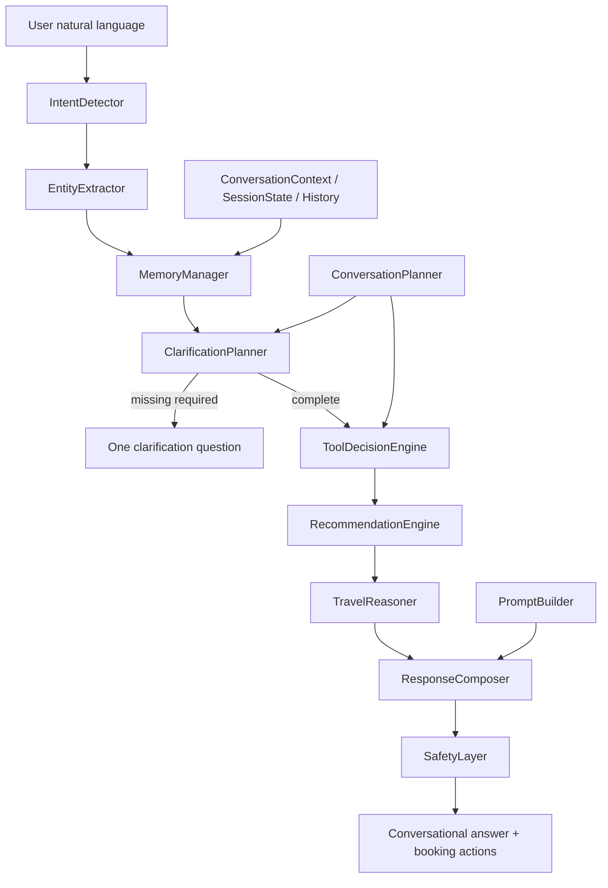

# Sprint 81 — Rahhal AI Brain Foundation (Phase 1)

**Branch:** `cursor/sprint81-brain-foundation-71ec`  
**Flag:** `ai.brain.v1` — **OFF by default** (also listed in `RECOVERY_FROZEN_OFF_FLAGS`)

## Goal

Architecture-first foundation to transform Rahhal into an **AI Travel Consultant**.

- No UI redesign
- No production behavior changes
- Not wired into `travelAgentService.planTurn`
- Distinct from production `ai.rahhal_brain` and frozen `brain.*` stacks

## Architecture diagram



## Folder structure

```text
src/lib/brain/v1/
  feature.ts                 # ai.brain.v1 gate
  types.ts                   # shared contracts
  pipeline.ts                # runBrainV1Turn
  IntentDetector.ts
  EntityExtractor.ts
  ConversationContext.ts
  MemoryManager.ts
  SessionState.ts
  ConversationHistory.ts
  ClarificationPlanner.ts
  ToolDecisionEngine.ts
  TravelReasoner.ts
  RecommendationEngine.ts
  ConversationPlanner.ts
  PromptBuilder.ts
  ResponseComposer.ts
  SafetyLayer.ts
  index.ts
```

Existing `src/lib/brain/{core,orchestrator,...}` remains untouched.

## Conversation flow (when flag ON in tests/harness)

1. Detect intent  
2. Extract entities  
3. Check session / conversation / long-term memory  
4. Determine missing information  
5. Ask **one** clarification question max  
6. Select tools/providers  
7. Rank injectable offers (no live provider calls in Phase 1)  
8. Reason in structured steps  
9. Compose natural response  
10. Prepare booking action stubs  
11. Safety pass  

## Feature flags

| Flag | Default | Role |
| --- | --- | --- |
| `ai.brain.v1` | **OFF** | This foundation |
| `ai.rahhal_brain` | ON | Existing production brain core (unchanged) |
| `brain.*` | OFF / frozen | Quarantined parallel stacks |

## Verify

```bash
npm run brain-v1:verify
npm run lint
npm run typecheck
npm run test:run -- src/lib/__tests__/recoveryPhase1.freeze.test.ts
```

## Out of scope (Phase 1)

- UI redesign  
- planTurn ownership changes  
- Live provider calls from Brain v1  

## Follow-on

Sprint 82 implements the reasoning engine inside this island — see `docs/SPRINT82_BRAIN_REASONING.md`. Flag remains `ai.brain.v1` OFF.
