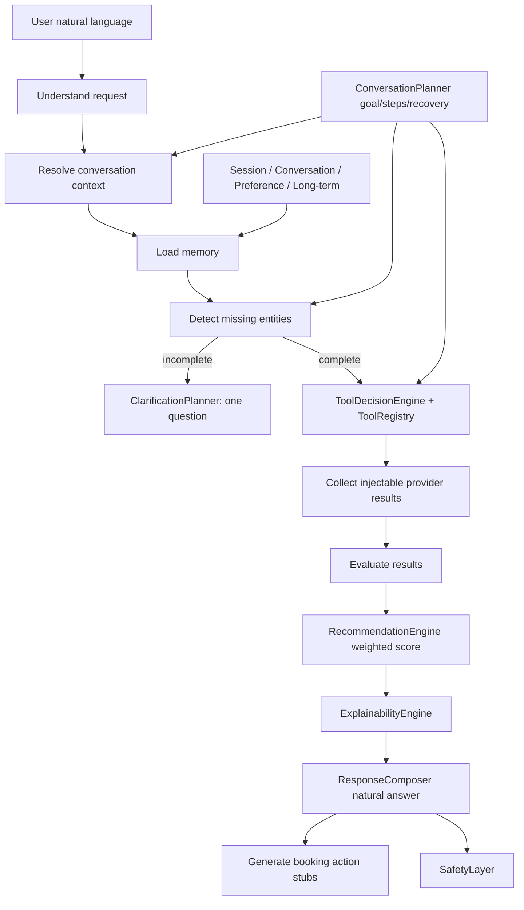

# Sprint 82 — Rahhal Brain V2 (Reasoning Engine)

**Branch:** `cursor/sprint82-brain-reasoning-71ec`  
**Flag:** `ai.brain.v1` — **OFF by default** (unchanged; recovery-frozen)  
**Version:** `2.0.0-brain-v2-reasoning`

## Goal

Implement the actual reasoning engine **inside** the Brain v1 island.

- No UI changes
- No Voice / booking / provider wiring
- No production `planTurn` connection
- Flag remains OFF

## Architecture diagram



## Reasoning flow

1. **Understand user request** — `IntentDetector`
2. **Resolve conversation context** — `ConversationContext` + hydrated `SessionState`
3. **Load memory** — session / conversation / preference / long-term interfaces
4. **Detect missing entities** — `ClarificationPlanner` (max one question)
5. **Choose tools** — `ToolDecisionEngine` via `ToolRegistry` (never hardcoded-only)
6. **Collect provider results** — injectable `candidateOffers` / `providerResultsByTool` only
7. **Evaluate results** — feasibility gate in reasoning trace
8. **Rank recommendations** — weighted overall score
9. **Generate natural answer** — `ResponseComposer` + explanation
10. **Generate booking actions** — stub `prepare_booking` only (no booking module changes)

## Conversation Planner

`ConversationPlanner` tracks:

| Field | Purpose |
| --- | --- |
| `currentGoal` | Intent-derived consultant goal |
| `completedSteps` | Finished pipeline steps |
| `remainingSteps` | Still-open steps |
| `nextAction` | clarify / invoke_tools / recommend / advise / chat / resume |
| `interrupted` / `resumed` | Recovery after interruption |
| `continuationSummary` | Human-readable continuation note |

## Tool registry

Registered tools: `flights`, `hotels`, `packages`, `maps`, `weather`, `visa`, `payments`, `knowledge`, `budget`, `advice`, `external_api`.

Selection is registry membership + intent tags + completeness — not a frozen switch map.

## Ranking weights (defaults)

| Factor | Weight |
| --- | --- |
| Price | 0.25 |
| Stops | 0.15 |
| Travel time | 0.15 |
| Refundability | 0.10 |
| Airline quality | 0.10 |
| Hotel quality | 0.10 |
| Traveler preferences | 0.10 |
| Historical choices | 0.05 |

## Clarification strategy

Destination-only Morocco example:

> "I want to go to Morocco." → "When would you like to travel?"

Never dumps budget / passengers / hotel / cabin in the same turn.

## Explainability

`ExplainabilityEngine` compares top vs second offer, e.g.:

> "I chose this flight because it is only 20 SAR more expensive but saves 5 hours."

## Memory

In-memory interfaces only (no persistence):

- Session Memory
- Conversation Memory
- Preference Memory
- Long-term Memory interface

## Folder structure

```text
src/lib/brain/v1/
  ToolRegistry.ts            # Sprint 82
  ExplainabilityEngine.ts    # Sprint 82
  TravelReasoner.ts          # multi-step trace
  ConversationPlanner.ts     # goals / recovery
  RecommendationEngine.ts    # weighted scoring
  ClarificationPlanner.ts    # one-question strategy
  ToolDecisionEngine.ts      # registry-driven
  MemoryManager.ts           # + preference memory
  SessionState.ts            # + planner / interrupt
  pipeline.ts                # full reasoning chain
  ...
```

## Verify

```bash
npm run brain-v2:verify
npm run typecheck && npm run lint && npm run build
```

## Out of scope

- Enabling `ai.brain.v1`
- Voice / UI / booking / live provider connections
- Persistence for long-term memory
- Merge without approval
