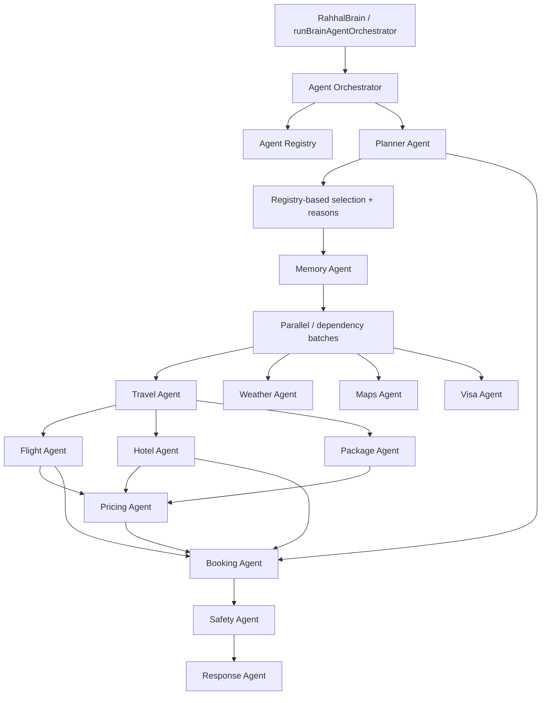
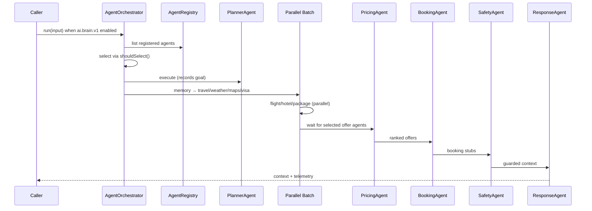
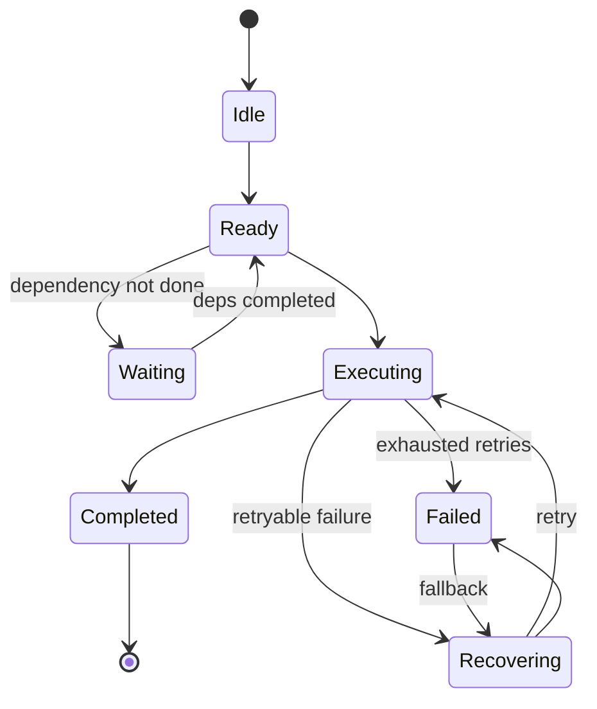

# Sprint 83 — Rahhal Agent Orchestrator

**Branch:** `cursor/sprint83-agent-orchestrator-71ec`  
**Flag:** `ai.brain.v1` — **OFF by default** (unchanged)  
**Version:** `1.0.0-agent-orchestrator`

## Goal

Build the AI Agent Orchestrator inside the Brain v1 island.

- No UI
- No Voice wiring
- No production `planTurn` wiring
- No live providers / booking module changes
- Draft PR only

## Architecture



## Sequence diagram



## Lifecycle diagram



Lifecycle values: `idle` · `ready` · `executing` · `waiting` · `recovering` · `completed` · `failed`

## Dependency graph

| Agent | Depends on (soft if not selected) | Parallel with |
| --- | --- | --- |
| planner | — | — |
| memory | planner | — |
| travel | planner, memory | weather, maps, visa |
| weather | memory | maps, visa, travel |
| maps | memory | weather, visa, travel |
| visa | memory | weather, maps, travel |
| flight | travel | hotel, package |
| hotel | travel | flight, package |
| package | travel | flight, hotel |
| pricing | flight, hotel, package | — |
| booking | planner, flight, hotel, pricing | — |
| safety | booking, pricing, memory | — |
| response | safety | — |

**Booking waits for** Planner + Flights + Hotels + Pricing (when those agents are selected).

## Agent registry

- Every agent calls `registry.register(definition)`
- Orchestrator discovers agents via `registry.list()`
- Selection uses each agent's `shouldSelect` / `selectionReason`
- Execution order comes from the dependency graph of the **selected** set — never a hardcoded global order

## Shared Agent Context

Conversation · Memory · Entities · Provider Results · Planner · Reasoning · Preferences · Ranked offers · Booking action stubs · Safety · Response

## Retry policy

Default: 3 attempts, timeout, retry on `timeout` | `temporary_failure` | `provider_unavailable`, optional fallback agent.

## Telemetry

Per agent: execution time, attempts, retries, failures, selected tools, lifecycle.  
Run-level: planner decisions, parallel batches, totals.

## Explainability

`selectedAgents[]` stores `{ agentId, reason }` for every chosen agent (also mirrored in telemetry.plannerDecisions).

## Folder structure

```text
src/lib/brain/v1/agents/
  types.ts
  AgentRegistry.ts
  AgentLifecycle.ts
  DependencyGraph.ts
  RetryPolicy.ts
  Telemetry.ts
  definitions.ts          # self-describing agents
  AgentOrchestrator.ts
  index.ts
```

## Verify

```bash
npm run brain-v3:verify
npm run brain-v2:verify
npm run typecheck && npm run lint && npm run build
```

## Follow-on

Sprint 84 adds the Travel Planning Engine — see `docs/SPRINT84_TRAVEL_PLANNING.md`.

## Out of scope

- Enabling `ai.brain.v1`
- UI / Voice / planTurn / live providers / booking module changes
- Merge without approval
