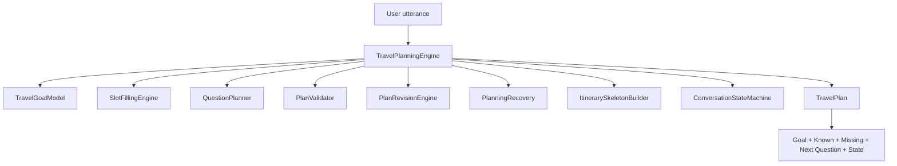
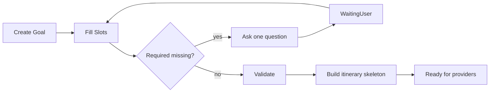
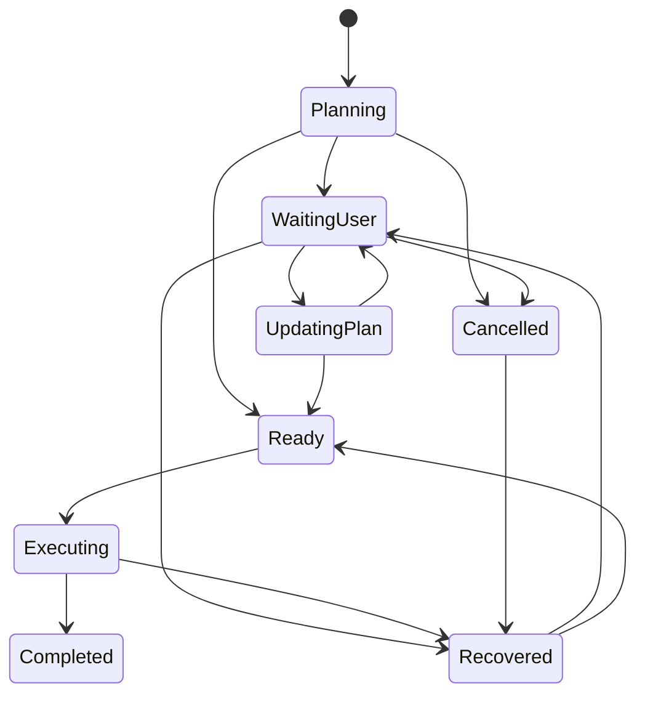

# Sprint 84 — Travel Planning Engine

**Branch:** `cursor/sprint84-travel-planning-71ec`  
**Flag:** `ai.brain.v1` — **OFF by default** (unchanged; no flag flips)  
**Version:** `1.0.0-travel-planning-engine`

## Goal

Convert user intent into a complete, executable travel plan **before** any provider is called.

- No UI / Voice
- No provider calls
- No booking changes
- No production `planTurn` wiring
- Draft PR only

## Example

User: `"I want to travel to Morocco."`

| Field | Value |
| --- | --- |
| Goal | Travel to Morocco |
| Known | Destination = Morocco |
| Missing | Dates (then origin, travelers) |
| Next question | When would you like to travel? |
| Plan state | `WaitingUser` |

## Architecture



## Planner lifecycle



## State machine



States: `Planning` · `WaitingUser` · `UpdatingPlan` · `Ready` · `Executing` · `Completed` · `Cancelled` · `Recovered`

## Slot model

| Slot | Required for trip readiness |
| --- | --- |
| destination | yes |
| dates / flexibleDates | yes (one of) |
| origin | yes (after destination + dates) |
| adults | yes (after origin) |
| children, cabin, budget, hotelPreference, transportation, activities, visa, language, currency, specialRequests | optional |

Question order (highest priority first): destination → dates → origin → adults → …

## Planning flow

1. Detect intent / continue prior intent on slot-fill  
2. Extract + merge slots (partial update only)  
3. Compute missing required slots  
4. Ask **one** QuestionPlanner question  
5. Validate (missing, conflicts, dates, travelers, budget)  
6. Revise affected execution steps only  
7. On complete required slots → itinerary skeleton (no providers)  
8. Recovery reuses `priorPlan` context  

## Folder structure

```text
src/lib/brain/v1/planning/
  types.ts
  TravelGoalModel.ts
  SlotFillingEngine.ts
  ConversationStateMachine.ts
  QuestionPlanner.ts
  PlanRevision.ts
  PlanValidator.ts
  Recovery.ts
  ItinerarySkeletonBuilder.ts
  TravelPlanningEngine.ts
  index.ts
```

## Entry point

```ts
runTravelPlanningTurn({ text, priorPlan?, interrupted? }, { enabled })
```

When `ai.brain.v1` is OFF → `{ enabled: false, plan: null }`.

## Verify

```bash
npm run brain-v4:verify
npm run brain-v3:verify
npm run typecheck && npm run lint && npm run build
```

## Follow-on

Sprint 85 adds the Tool Execution Engine — see `docs/SPRINT85_TOOL_EXECUTION.md`.

## Out of scope

- Enabling `ai.brain.v1`
- UI / Voice / providers / booking / API / planTurn wiring
- Merge without approval
