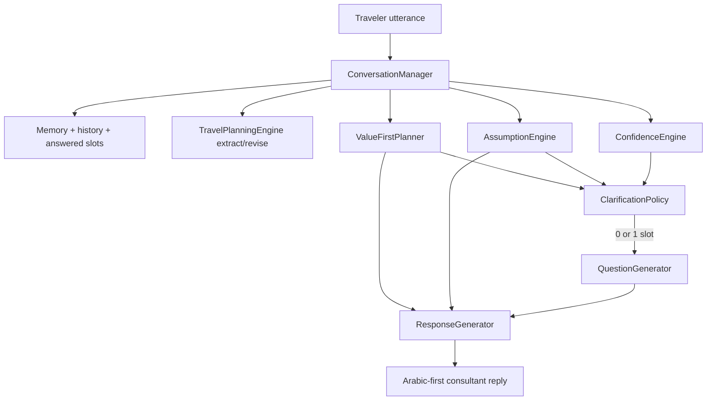
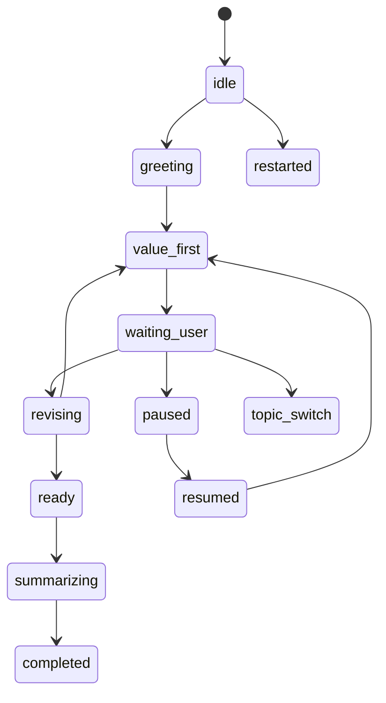

# Sprint 85 — Conversation Manager & Response Generator

**Branch:** `cursor/sprint85-conversation-manager-71ec`  
**Flag:** `ai.brain.v1` — **OFF by default** (unchanged)  
**Version:** `1.1.0-value-before-questions`  
**PR:** #323 (stacked on Sprint 85 tool execution)

> Companion to `docs/SPRINT85_TOOL_EXECUTION.md` (tool simulator). This document covers the **conversation layer** that talks to the traveler before any live provider integration.

## Goal

Complete the Brain’s ability to run a full natural conversation as an intelligent travel consultant:

- Deliver useful preliminary value before optional clarification  
- Ask at most one high-impact question per normal turn  
- Infer safe, reversible assumptions instead of blocking on every missing slot  
- Understand follow-ups and revise only affected plan parts  
- Continue interrupted conversations without repeating answered questions  
- Generate natural bilingual (Arabic-first) responses  
- Summarize decisions and explain why a question / recommendation was chosen  

**No** Amadeus / Booking / live APIs / UI / Voice / payments / production wiring.  
**No** enabling `ai.brain.v1`.

---

## Value Before Questions Architecture

Rahhal must behave like a travel consultant, not a booking form.

**Anti-pattern (forbidden default):**

> User: “I want to travel to Morocco.”  
> Rahhal: “When would you like to travel?”

**Required default:**

1. Understand the travel goal  
2. Extract known information from the message, history, memory, and context  
3. Infer safe, reversible assumptions for missing non-sensitive fields  
4. Produce immediately useful preliminary value  
5. Label important assumptions when helpful  
6. Ask **at most one** concise high-impact follow-up when it materially improves the result  
7. Continue progressively — never trap the user in a questionnaire  

### Decision flow



Internal decision model (never dumped as raw JSON to the user):

```json
{
  "goalUnderstanding": "...",
  "value": [],
  "assumptions": [],
  "question": null,
  "questionReason": null,
  "confidence": 0,
  "requiresConfirmationBeforeAction": false,
  "nextBestAction": "..."
}
```

### Blocking vs high-impact vs optional fields

| Tier | Meaning | Question policy |
| --- | --- | --- |
| **Blocking** | Real action cannot safely/technically proceed | May ask **one** direct question (booking identity, payment consent, mandatory provider field, missing destination for any plan) |
| **High-impact** | Substantially changes price, availability, suitability, safety, or feasibility | May ask **one** question **after** useful preliminary value whenever possible (origin, approximate dates, travelers, strict budget) |
| **Optional** | Personalization only | Must **not** block the first useful answer (hotel style, cuisine, neighborhood, seat, activity detail) |

Explore-stage ask order after destination is known: **origin → adults → dates → budget** (dates skipped while `flexibleDates` is assumed).

### Safe assumptions

Each assumption has: `field`, `assumedValue`, `reason`, `confidence`, `reversibility`, `requiresConfirmationBeforeBooking`.

Typical explore defaults:

| Field | Assumed value | Notes |
| --- | --- | --- |
| `tripType` | leisure | Reversible |
| `adults` | 1 | Stored as assumption, **not** a confirmed fact |
| `flexibleDates` | true | Suppresses date questions in explore until needed |
| `budgetMode` | balanced | Mid-range frame |
| `cabin` | economy | Reversible |
| `hotelCategory` | mid-range | Reversible |

Rules:

- Never override an explicit user statement  
- Never silently assume passport, visa, payment, identity, health, or accessibility facts  
- Never treat assumptions as confirmed facts on `answeredSlots`  
- Assumptions are revisable immediately when the user corrects them  
- Must be confirmed before irreversible booking/payment  

### One-question budget

- Default: `maximumQuestionsPerTurn = 1`  
- Zero questions when enough information exists for a useful reply  
- More than one only for safety, legal compliance, payment confirmation, identity/documents, or technically mandatory provider fields for an immediate requested action  
- Do **not** combine fields into a compound questionnaire  

### Progressive disclosure

The first useful response normally contains:

1. Concise understanding of the goal  
2. Immediate value / preliminary options  
3. Assumptions used (when relevant)  
4. At most one next question  
5. A clear path to revise assumptions  

Do **not** dump internal reasoning, slot tables, provider errors, confidence scores, or implementation details.

### Confidence behavior

| Band | Behavior |
| --- | --- |
| High | Answer directly (0 questions when possible) |
| Medium | Answer with disclosed assumptions; optionally one refinement question |
| Low + safe | Bounded preliminary value + at most one clarification |
| Low + unsafe | One necessary blocking question (no fabricated certainty) |

Low confidence does **not** automatically force a questionnaire or repeated questions.

### Revision behavior

When the user provides new information, revise only the affected parts.

Example:

- Assumed: 1 adult, flexible dates, mid-range budget  
- User: “We are two adults and one child.”  
- Result: update traveler composition; keep destination and unrelated plan decisions; remove the adults assumption  

### Tool execution rules

Exploratory / recommendation / estimate / destination-knowledge / comparison tools may run with safe assumptions.

Confirmed data is required only for live booking, payment, ticket issuance, irreversible reservations, mandatory provider fields, or legally required details.

Tools return **structured missing-field** reports. They do **not** generate multi-question questionnaires. `ConversationManager` decides whether to ask (≤1).

### Booking / payment confirmation boundary

- Assumptions that affect booking require confirmation before action (`requiresConfirmationBeforeBooking`)  
- Blocking fields (passport, payment consent, traveler identity) may force one blocking question  
- Brain v1 remains unwired from production booking/payment paths  

### Morocco example

**Input:** “I want to travel to Morocco.”

**Expected shape (EN):**

> Excellent choice. For a first Morocco trip, I would initially compare Marrakech for culture and activities, Agadir for a relaxed coastal stay, and Casablanca if business access or flight connectivity matters most. … temporarily assuming flexible dates and a balanced mid-range budget — indicative only … Which city will you depart from?

**Expected shape (AR):** consultant tone with city comparison + temporary assumptions + one origin question. Avoid robotic form phrases (`يرجى إدخال`, `الرجاء تعبئة`, `البيانات المطلوبة`, `لا يمكن المتابعة`). Prefer:

- سأبدأ لك بخيار مبدئي  
- بناءً على المعلومات الحالية  
- أستطيع تجهيز تصور أولي الآن  
- سأفترض مؤقتًا  
- لتضييق النتائج، أحتاج فقط إلى معرفة...  
- يمكنك تعديل أي افتراض لاحقًا  

### Arabic-first examples

**Value + one question:**

> اختيار ممتاز. للرحلة الأولى أقارن مراكش … أستطيع تجهيز تصور أولي الآن، وسأفترض مؤقتًا تواريخ مرنة وميزانية متوسطة متوازنة … من أي مدينة ستسافر؟

**Zero questions (enough info):**

> بناءً على المعلومات الحالية أستطيع تجهيز تصور أولي لـMorocco … (no trailing questionnaire)

### When asking a question first is still required

- Missing destination with no usable goal  
- Booking/payment stage needs passport / traveler identity / explicit payment consent  
- Low confidence **and** unsafe / impossible to provide even bounded value  
- Provider/tool reports a single **blocking** mandatory field for an immediate irreversible action  

Even then: **one** question, not a form.

---

## Conversation lifecycle



## Response generation

- Arabic-first consultant tone with English twin  
- Order: value → assumptions (when relevant) → ≤1 question  
- Tones: `friendly` · `clarify` · `summary` · `revise` · `resume` · `pause` · `value_first`  
- Live prices, availability, schedules, inventory, weather, visa rules, and provider data are **never fabricated**; preliminary output is labeled indicative / estimated / based on assumptions  

## Interrupt handling

| Signal | Effect |
| --- | --- |
| pause | Freeze session; keep slots |
| resume / continue | Restore value-first / waiting path without re-asking answered slots |
| topic switch | Push previous goal onto stack |
| return previous | Surface prior goal label |

## Entry point

```ts
runConversationManagerTurn(
  { text, priorSession?, pause?, resume?, restart?, stage?, blockingFields?, toolMissingFields? },
  { enabled },
)
```

When `ai.brain.v1` is OFF → `{ enabled: false }` (production no-op).

## Folder structure

```text
src/lib/brain/v1/conversation/
  ConversationManager.ts
  AssumptionEngine.ts
  ValueFirstPlanner.ts
  ToolMissingFields.ts
  QuestionGenerator.ts
  ResponseGenerator.ts
  ClarificationPolicy.ts
  ConfidenceEngine.ts
  ConversationSummaryBuilder.ts
  InterruptHandler.ts
  ConversationMemoryAdapter.ts
  ConversationExplainability.ts
  types.ts
  index.ts
```

## Verify

```bash
npm run brain-conversation:verify
npm run brain-v5:verify
npm run brain-v4:verify
npm run typecheck && npm run lint && npm run build
npm run test:run -- src/lib/__tests__/recoveryPhase1.freeze.test.ts
```

## Out of scope

- Enabling `ai.brain.v1`  
- UI / Voice / STT / TTS / live providers / booking / payments / `travelAgentService.planTurn` wiring  
- Merge without explicit approval  
- New PR (update #323 only)  
