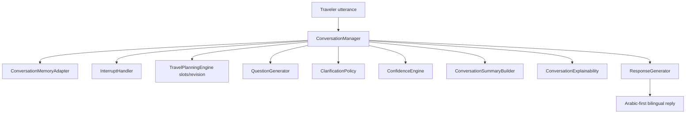
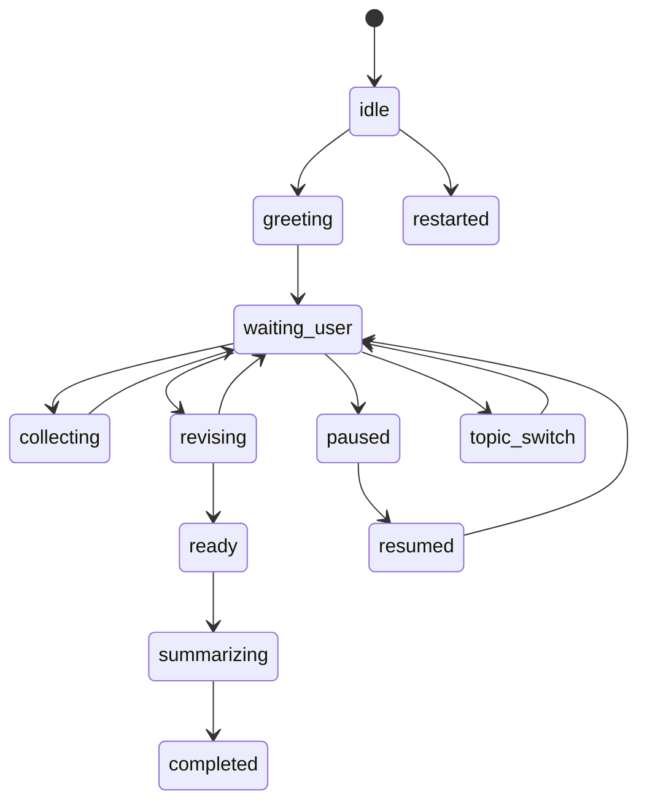
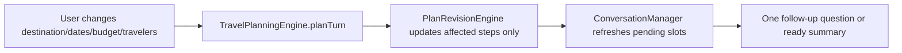

# Sprint 85 — Conversation Manager & Response Generator

**Branch:** `cursor/sprint85-conversation-manager-71ec`  
**Flag:** `ai.brain.v1` — **OFF by default** (unchanged)  
**Version:** `1.0.0-conversation-manager`

> Companion to `docs/SPRINT85_TOOL_EXECUTION.md` (tool simulator). This document covers the **conversation layer** that talks to the traveler before any live provider integration.

## Goal

Complete the Brain’s ability to run a full natural conversation:

- Ask only one missing question at a time  
- Understand follow-ups  
- Continue interrupted conversations  
- Revise plans when requirements change  
- Generate natural bilingual responses  
- Summarize decisions  
- Explain why a question / recommendation was chosen  

**No** Amadeus / Booking / live APIs / UI / Voice / payments / production wiring.

## Architecture



## Conversation lifecycle



## Question policy

1. Compute missing **required** slots from the travel plan  
2. Remove already-answered slots  
3. Pick **exactly one** highest-priority question  
4. Attach explainability (`whyAr` / `whyEn`)  
5. Never dump destination + dates + travelers + budget together  

Core order: Destination → Dates → Origin → Travelers → Budget → Preferences

## Response generation

- Friendly, short, conversational  
- Arabic-first templates with English twin  
- Tones: `friendly` · `clarify` · `summary` · `revise` · `resume` · `pause`

## Revision flow



## Interrupt handling

| Signal | Effect |
| --- | --- |
| pause | Freeze session; keep slots |
| resume / continue | Restore waiting/ready path |
| topic switch | Push previous goal onto stack |
| return previous | Surface prior goal label |

## Confidence

Tracks intent / entities / slots / recommendations.  
Low overall confidence while slots remain → clarification tone.

## Entry point

```ts
runConversationManagerTurn({ text, priorSession?, pause?, resume?, restart? }, { enabled })
```

When `ai.brain.v1` is OFF → `{ enabled: false }`.

## Folder structure

```text
src/lib/brain/v1/conversation/
  ConversationManager.ts
  QuestionGenerator.ts
  ResponseGenerator.ts
  ClarificationPolicy.ts
  ConfidenceEngine.ts
  ConversationSummaryBuilder.ts
  InterruptHandler.ts
  ConversationMemoryAdapter.ts
  ConversationExplainability.ts
  types.ts
  index.ts
```

## Verify

```bash
npm run brain-conversation:verify
npm run brain-v5:verify
npm run typecheck && npm run lint && npm run build
```

## Out of scope

- Enabling `ai.brain.v1`
- UI / Voice / live providers / booking / payments  
- Merge without approval
