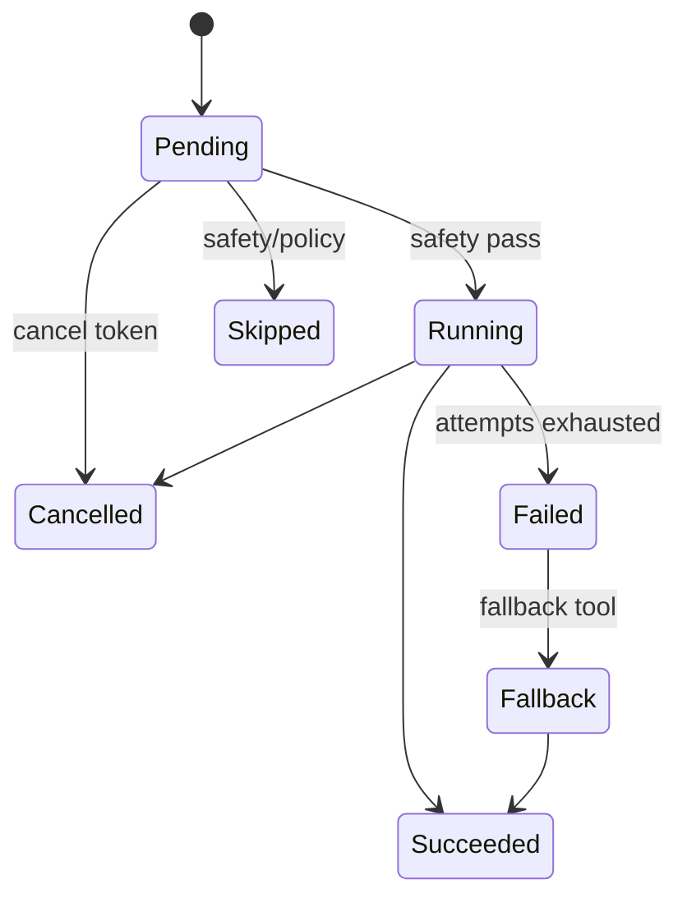

# Sprint 85 — Tool Execution Engine

**Branch:** `cursor/sprint85-tool-execution-71ec`  
**Flag:** `ai.brain.v1` — **OFF by default** (unchanged)  
**Version:** `1.0.0-tool-execution-engine`

## Goal

Connect the Brain to tools through a unified execution layer.

- No UI / Voice
- No real provider calls
- No booking execution / provider modification
- No production wiring
- Draft PR only

## Architecture

```mermaid
flowchart TD
  D[ToolDecision[]] --> E[ToolExecutionEngine]
  E --> S[ExecutionSafety]
  E --> R[DependencyResolver]
  R --> B[Parallel / sequential batches]
  B --> X[ToolExecutor]
  X --> SIM[ExecutionSimulator mock only]
  X --> T[ExecutionTelemetry]
  X --> FR[Retry / Fallback / Skip / Cancel]
  X --> M[ResultMerger]
  M --> U[UnifiedToolResult / MergedExecutionResults]
```

## Execution lifecycle



## Tool pipeline

1. Receive `ToolDecision[]` (tool, reason, params, policy, deps, fallback)  
2. Safety: feature flag, slots, availability, rate limits, permissions  
3. Resolve dependency batches  
4. Execute batch (parallel where independent) via **ExecutionSimulator**  
5. Retry / fallback / skip / cancel per policy  
6. Merge into unified results (strip provider-shaped keys)  
7. Emit telemetry  

## Dependency graph

| Tool | Depends on (when selected) |
| --- | --- |
| pricing | flights, hotels, packages |
| booking | flights, hotels, pricing |
| weather / maps / visa / currency | — (parallel cohort) |

## Parallel cohort

`weather` · `maps` · `visa` · `currency` execute simultaneously when co-selected.

## Retry strategy

- Default max attempts: 3  
- Timeout per attempt (default 50ms in harness)  
- Retry on thrown errors / injected temporary failures  
- On exhaustion → optional `fallback` tool via simulator  

## Recovery strategy

- Retry same tool  
- Fallback to alternate tool  
- Continue remaining batches (graceful degradation)  
- Cancellation token aborts further work  

## Supported tool types

Flights · Hotels · Packages · Weather · Maps · Visa · Knowledge · Currency · Pricing · Calendar · Booking (stub only) · External APIs

## Entry point

```ts
runToolExecution(request, { enabled })
```

When `ai.brain.v1` is OFF → `{ enabled: false }`.

## Folder structure

```text
src/lib/brain/v1/execution/
  types.ts
  ToolExecutor.ts
  ToolExecutionEngine.ts
  ExecutionContext.ts
  ExecutionSimulator.ts
  ExecutionSafety.ts
  DependencyResolver.ts
  ResultMerger.ts
  ExecutionTelemetry.ts
  CancellationToken.ts
  index.ts
```

## Verify

```bash
npm run brain-v5:verify
npm run brain-v4:verify
npm run typecheck && npm run lint && npm run build
```

## Out of scope

- Enabling `ai.brain.v1`
- UI / Voice / real providers / booking capture / provider file changes
- Merge without approval
